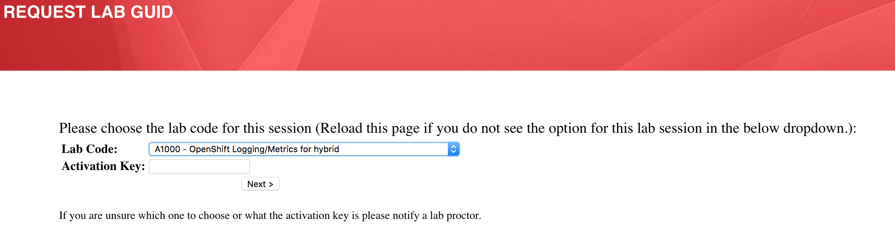
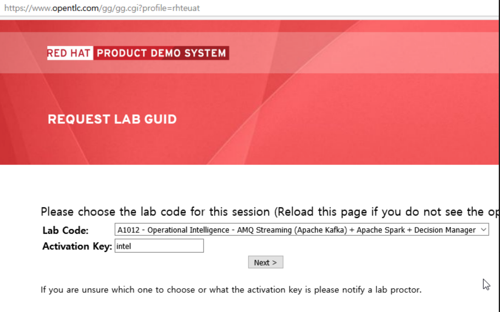
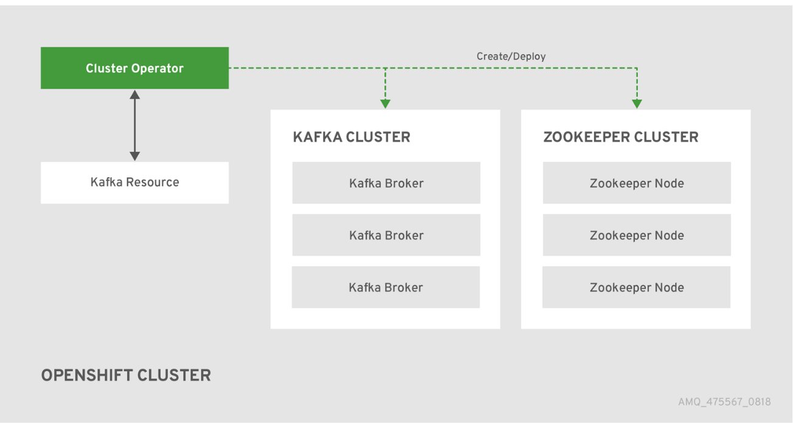

:noaudio:
:scrollbar:
:data-uri:
:toc2:
:linkattrs:

= Kafka ingest and publish lab

.Goals
* Create a Kafka publisher and consumer on a pre-built Kafka deployment
* Create a Kafka connector configured for reading the Uber data file
* Verify that the contents are published on the configured topic using a MsgConsumer

.Prerequisite
* Skills
**
**
* Tools
** `curl` utility
** `oc` version 3.9 utility

:numbered:

== Overview

This lab implements the Kafka producer and consumer scenario.

=== Reference

. Kafka on Openshift:
.. link:https://strimzi.io[Project]
+
Kafka on Openshift functionality is provided by the Strimzi project (link above).

== Lab Environment

Your lab environment consists of a remote virtual machine that is accessible via the ssh protocol.

This virtual machine comes pre-installed with OpenShift Container Platform v3.9.

=== Order VM via `GUID Grabber`

This section of the lab explains how to access the Red Hat Tech Exchange _GuidGrabber_ in order to obtain a GUID.
This GUID will be used to access the lab environment.

. Begin by going to http://bit.ly/rhte-guidgrabber
+

. From this page select the *Lab Code* :  _A1012_

. Enter the *Activation Key* provided by the lab proctor.

. Click *Next*.

. The resulting page will display your lab's GUID and other useful information about your lab environment.
+

. Your remote virtual machine is accessible via the `ssh` protocol.
+
Follow the directions exactly as indicated in the Guid Grabber Information Page to ssh into your remote lab VM.

. When you are completely done with your lab environment, please click *Reset Workstation* so that you can move on to the next lab.
If you fail to do this, you will be locked into the GUID from the previous lab.
+
[NOTE]
Clicking *Reset Workstation* will not stop or delete the lab environment.

=== Environment Variables

Once you ssh'd into your remote terminal window, you'll want to set the following environment variables in your shell:

-----

echo "export OCP_USERNAME=developer" >> ~/.bashrc
echo 'export OCP_PASSWD=r3dh4t1!' >> ~/.bashrc
echo "export OCP_PROJECT=$OCP_USERNAME-lab1-kafka-project" >> ~/.bashrc

echo "export OCP_REGION=`echo $HOSTNAME | cut -d'.' -f2`" >> ~/.bashrc
echo "export OCP_DOMAIN=clientvm.\$OCP_REGION.rhte.opentlc.com" >> ~/.bashrc
echo "export OCP_WILDCARD_DOMAIN=apps.\$OCP_DOMAIN" >> ~/.bashrc

source ~/.bashrc

-----

=== Utilities and resources

. Validate that the following exists in the $PATH of the remote virtual machine:

. _git_
. _curl_
. _sed_
. _oc_

. Validate that your virtual machine consists of 16GB RAM and 4 CPUs.
.. Execute:
+
-----
$ cat /proc/meminfo | grep MemTotal

MemTotal:        16016680 kB
-----

.. Execute:
+
-----
$ cat /proc/cpuinfo | awk '/^processor/{print $3}' | wc -l

4
-----

=== OpenShift Container Platform

You lab environment is built on Red Hat's OpenShift Container Platform.

Access to your OCP resources can be gained via both the `oc` utility as well as the OCP web console.

. Verify that OCP has started:
+
-----
$ sudo systemctl status oc-cluster

...

Aug 31 21:58:27 clientvm.a4f6.rhte.opentlc.com occlusterup[20544]: Server Information ...
Aug 31 21:58:27 clientvm.a4f6.rhte.opentlc.com occlusterup[20544]: OpenShift server started.
Aug 31 21:58:27 clientvm.a4f6.rhte.opentlc.com occlusterup[20544]: The server is accessible via web console at:
Aug 31 21:58:27 clientvm.a4f6.rhte.opentlc.com occlusterup[20544]: https://clientvm.a4f6.rhte.opentlc.com:8443
Aug 31 21:58:27 clientvm.a4f6.rhte.opentlc.com occlusterup[20544]: You are logged in as:
Aug 31 21:58:27 clientvm.a4f6.rhte.opentlc.com occlusterup[20544]: User:     developer
Aug 31 21:58:27 clientvm.a4f6.rhte.opentlc.com occlusterup[20544]: Password: <any value>
Aug 31 21:58:27 clientvm.a4f6.rhte.opentlc.com occlusterup[20544]: To login as administrator:
Aug 31 21:58:27 clientvm.a4f6.rhte.opentlc.com occlusterup[20544]: oc login -u system:admin
Aug 31 21:58:27 clientvm.a4f6.rhte.opentlc.com systemd[1]: Started OpenShift oc cluster up Service.
-----

. Using the `oc` utility, log into OpenShift
+
-----
$ oc login https://$HOSTNAME:8443 -u $OCP_USERNAME -p $OCP_PASSWD
-----

. Ensure that your `oc` client is the same minor release version as the server:
+
-----
$ oc version

oc v3.9.30
kubernetes v1.9.1+a0ce1bc657
features: Basic-Auth GSSAPI Kerberos SPNEGO

Server https://master.a4ec.openshift.opentlc.com:443
openshift v3.9.31
kubernetes v1.9.1+a0ce1bc657
-----

.. In the above example, notice that version of the `oc` client is of the same minor release (v3.9.30) of the OpenShift server (v3.9.31)
.. There are known subtle problems with using a version of the `oc` client that is different from your target OpenShift server.

. View existing projects:
+
-----
$ oc get projects

...

developer-lab1-kafka-project                                     Active
-----
+
This is the project where your Strimzi project is pre-provisioned.

. Log into OpenShift Web Console
.. Many OpenShift related tasks found in this lab can be completed in the Web Console (as an alternative to using the `oc` utility`.
.. To access, point to your browser to the output of the following:
+
-----
$ echo -en "\n\nhttps://$OCP_DOMAIN:8443\n\n"
-----

.. Authenticate using the values of $OCP_USERNAME and $OCP_PASSWD

=== Kafka cluster

Your lab environment includes access to a pre-installed Kafka cluster. The environment was creating using an Ansible script which creates the operators and deployments required by Kafka. The strimzi-cluster-operator is the first entity that gets created (see detailed description that follows). The Cluster Operator is also able to deploy a Kafka Connect cluster which connects to an existing Kafka cluster. 

. Switch to your OpenShift project
+
-----
$ oc project $OCP_PROJECT
-----

. View the various Deployments:
+
-----
$ oc get deploy

NAME                         DESIRED   CURRENT   UP-TO-DATE   AVAILABLE   AGE
my-connect-cluster-connect   1         1         1            1           1h
strimzi-cluster-operator     1         1         1            1           1h

-----

.. *my-connect-cluster-connect*
+
The Kafka connect cluster allows for connecting Kafka brokers to different sources and sinks. In the case of this lab, the Kafka connect deployment is pre-configured for reading files.

.. *strimzi-cluster-operator*
+
Before deploying a Kafka cluster, the Cluster Operator must be deployed. The Strimzi cluster operator is responsible for deploying a Kafka cluster alongside a Zookeeper ensemble. As mentioned above, the operator is also used to deploy Kafka connect. 
+

.. View the corresponding pods:
+
-----
$ oc get pods

NAME                                          READY     STATUS    RESTARTS   AGE
my-cluster-kafka-0                            2/2       Running   0          1h
my-cluster-kafka-1                            2/2       Running   0          1h
my-cluster-kafka-2                            2/2       Running   0          1h
my-cluster-zookeeper-0                        2/2       Running   0          1h
my-cluster-zookeeper-1                        2/2       Running   0          1h
my-cluster-zookeeper-2                        2/2       Running   0          1h
my-connect-cluster-connect-5f8dcd95b9-f6sm4   1/1       Running   1          1h
strimzi-cluster-operator-7fbd7f6fcc-9nt9h     1/1       Running   0          1h

-----

.. *my-cluster-kafka-**
+
This is the set of Kafka brokers deployed using the Strimzi cluster operator. The deployment is described in a yaml file that pulls the amqstreams image from the RHT registry. AMQ Streams provides two options for Kafka cluster deployment:ephemeral and persistent. Persistent is the correct option to select for production environments (we have used the same in this deployment).

.. *my-cluster-zookeeper-**
+
When installing Kafka, AMQ Streams also installs a Zookeeper cluster and adds the necessary configuration to connect Kafka with Zookeeper. 

. Pre-provisioned Topics:
+
Your lab environment comes pre-provisioned with the following _KafkaTopic_ resources (which are only observable by a cluster-admin):
+
-----
# oc get KafkaTopic

NAME         AGE
my-topic     1h
my-topic-2   1h
-----
+
As part of the Kafka cluster, it can also deploy the topic operator which provides operator-style topic management via KafkaTopic custom resources. To view the topics, you will need to sudo inside the cluster. At this point, you will be logged into the cluster as cluster-admin and you will be able to perform the above command to get the topics.
+
-----
$ sudo -i
$ oc get KafkaTopic
-----

== Lab Asset Overview

This lab provides a set of assets to assist with the utilization of Strimzi.
You will want to clone these lab assets to your lab environment so that you can review them.

. Make a new directory where all lab assets will reside:
+
-----
$ mkdir -p $HOME/lab
-----

. At the terminal of your lab environment, clone the lab assets:
+
-----
$ git clone https://github.com/gpe-mw-training/operational_intelligence.git $HOME/lab/operational_intelligence
-----

. Change directories to the `strimzi` directory of the newly cloned project:
+
-----
$ cd $HOME/lab/operational_intelligence/strimzi
-----

. Review the details of the lab assets found in this directory:

.. *strimzi-consumer.yaml*
+
[red]#TODO#

.. *strimzi-producer.yaml*
+
[red]#TODO#

== Kafka producer and consumer
In this section of the lab, you will provision a Strimzi producer and consumer.

These resources will send to and receive from the previously created Strimzi topics.

. Create the Strimzi consumer:
.. Execute:
+
-----
$ oc create -f $HOME/lab/operational_intelligence/strimzi/strimzi-consumer.yaml
-----
.. View the Strimzi consumer logs:
+
-----
$ oc logs $(oc get pod -l app=kafka-consumer -o=jsonpath='{.items[0].metadata.name}') -f

...

TODO:   What's the expected output ?
-----

. Create the Strimzi producer:
.. Execute:
+
-----
$ oc create -f $HOME/lab/operational_intelligence/strimzi/strimzi-producer.yaml
-----
.. View the Strimzi producer logs:
+
-----
$ oc logs $(oc get pod -l app=kafka-producer -o=jsonpath='{.items[0].metadata.name}') -f

...

TODO:   What's the expected output ?
-----

== Additional Strimzi consumer

[red]#TODO:   Elaborate on the purpose of this section. Limits and requests will be needed#

. Add a consumer by creating a deployment yaml file similar to the existing one. The initial section of it should look similar to
+
----
apiVersion: extensions/v1beta1
kind: Deployment
metadata:
  labels:
    app: kafka-consumer-2
  name: kafka-consumer-2
spec:
  replicas: 1
  template:
    metadata:
      labels:
        app: kafka-consumer-2
    spec:
      containers:
      - name: kafka-consumer-2
        image: strimzici/hello-world-consumer:support-training
----
+
. Deploy the new consumer
+
----
% oc apply -f deployment-new.yaml
----
+
. Observe that the new consumer now receives from one or more partitions that are distinct from the kafka-consumer. The output in their respective logs will look similar to:
+
----
2018-08-30 18:31:58 INFO  KafkaConsumerExample:24 - Received message:
2018-08-30 18:31:58 INFO  KafkaConsumerExample:25 - 	     partition: 0
2018-08-30 18:31:58 INFO  KafkaConsumerExample:26 - 	     offset: 137772
2018-08-30 18:31:58 INFO  KafkaConsumerExample:27 - 	     value: Hello world - 103
2018-08-30 18:32:00 INFO  KafkaConsumerExample:24 - Received message:
2018-08-30 18:32:00 INFO  KafkaConsumerExample:25 - 	     partition: 1
2018-08-30 18:32:00 INFO  KafkaConsumerExample:26 - 	     offset: 137766
2018-08-30 18:32:00 INFO  KafkaConsumerExample:27 - 	     value: Hello world - 105
2018-08-30 18:32:01 INFO  KafkaConsumerExample:24 - Received message:
2018-08-30 18:32:01 INFO  KafkaConsumerExample:25 - 	     partition: 0
2018-08-30 18:32:01 INFO  KafkaConsumerExample:26 - 	     offset: 137773
2018-08-30 18:32:01 INFO  KafkaConsumerExample:27 - 	     value: Hello world - 106
2018-08-30 18:32:03 INFO  KafkaConsumerExample:24 - Received message:
2018-08-30 18:32:03 INFO  KafkaConsumerExample:25 - 	     partition: 1
2018-08-30 18:32:03 INFO  KafkaConsumerExample:26 - 	     offset: 137767
2018-08-30 18:32:03 INFO  KafkaConsumerExample:27 - 	     value: Hello world - 108
2018-08-30 18:32:04 INFO  KafkaConsumerExample:24 - Received message:
2018-08-30 18:32:04 INFO  KafkaConsumerExample:25 - 	     partition: 0
2018-08-30 18:32:04 INFO  KafkaConsumerExample:26 - 	     offset: 137774
2018-08-30 18:32:04 INFO  KafkaConsumerExample:27 - 	     value: Hello world - 109
2018-08-30 18:32:06 INFO  KafkaConsumerExample:24 - Received message:
2018-08-30 18:32:06 INFO  KafkaConsumerExample:25 - 	     partition: 1
2018-08-30 18:32:06 INFO  KafkaConsumerExample:26 - 	     offset: 137768
2018-08-30 18:32:06 INFO  KafkaConsumerExample:27 - 	     value: Hello world - 111
2018-08-30 18:32:07 INFO  KafkaConsumerExample:24 - Received message:
2018-08-30 18:32:07 INFO  KafkaConsumerExample:25 - 	     partition: 0
2018-08-30 18:32:07 INFO  KafkaConsumerExample:26 - 	     offset: 137775
2018-08-30 18:32:07 INFO  KafkaConsumerExample:27 - 	     value: Hello world - 112
----
+
*and*
+
----
2018-08-30 18:24:42 INFO  KafkaConsumerExample:24 - Received message:
2018-08-30 18:24:42 INFO  KafkaConsumerExample:25 - 	     partition: 2
2018-08-30 18:24:42 INFO  KafkaConsumerExample:26 - 	     offset: 137630
2018-08-30 18:24:42 INFO  KafkaConsumerExample:27 - 	     value: Hello world - 674
2018-08-30 18:24:45 INFO  KafkaConsumerExample:24 - Received message:
2018-08-30 18:24:45 INFO  KafkaConsumerExample:25 - 	     partition: 2
2018-08-30 18:24:45 INFO  KafkaConsumerExample:26 - 	     offset: 137631
2018-08-30 18:24:45 INFO  KafkaConsumerExample:27 - 	     value: Hello world - 677
2018-08-30 18:24:48 INFO  KafkaConsumerExample:24 - Received message:
2018-08-30 18:24:48 INFO  KafkaConsumerExample:25 - 	     partition: 2
2018-08-30 18:24:48 INFO  KafkaConsumerExample:26 - 	     offset: 137632
2018-08-30 18:24:48 INFO  KafkaConsumerExample:27 - 	     value: Hello world - 677
----

=== Configure Kafka connector

. In the resources/kafka-connect/kafka-connect.yaml, under the spec object, review the configuration
+
----
  config:
    key.converter: org.apache.kafka.connect.storage.StringConverter
    value.converter: org.apache.kafka.connect.storage.StringConverter
    key.converter.schemas.enable: false
    value.converter.schemas.enable: false
----

. Open a terminal in the Kakfa connect pod and verify that the input file has been copied to the /opt/kafka directory.

. A topic (file-publish) that Kafka Connect uses to publish to the Kafka broker has been created for you

. Create the configuration for the file source
+
----
% cat <<EOF >> /tmp/source-plugin.json
{
  "name": "source-test",
  "config": {
    "connector.class": "FileStreamSource",
    "tasks.max": "3",
    "topic": "UberInput",
    "file": "/tmp/uber.csv"
  }
}
EOF
----

. Create a connector that will read the data file and push its content into the Kafka broker
+
----
% curl -X POST -H "Content-Type: application/json" --data @/tmp/source-plugin.json http://localhost:8083/connectors
----

. Verify the contents are being published to the message consumer configured.
+
2018-08-21 22:08:26 INFO  KafkaConsumerExample:27 -	value: {"schema":{"type":"string","optional":false},"payload":"{1, 100, \"nandan\", \"uber data\", 15}"}

== Conclusions

* Can you appreciate the value of Kakfa in any customer use cases that you may have?

== Questions

//TO-DO :  questions to test student knowledge of the concepts / learning objectives of this lab

* What is the purpose for the use of the *source-plugin.json* plugin?

== Appendix
ifdef::showscript[]

endif::showscript[]
