:noaudio:
:scrollbar:
:data-uri:
:toc2:
:linkattrs:

= Spark Analysis of Historical Data

.Prerequisite
* Skills
** Programming Knowledge of Python, Scala and Java Languages
** Knowledge of git
** Knowledge on OpenShift Deployments
** Basic Knowledge of Cluster Computing and Distributed Architectures

* Tools
** `curl` utility
** `sed` utility
** `oc` version 3.9 utility
** `Interactive Notebooks - Apache Zeppelin`
** `git` command basics

:numbered:

== Overview

=== Lab Goals

* Apache Spark Deployment using Apache Zeppelin on Oshinko Cluster
* Uber Historical Data Analysis using Apache Spark
* Usage of Interactive NoteBooks like Apache Zeppelin

=== Technical Background

==== Apache Spark
. *Apache Spark*
+
Apache Spark is a fast, easy-to-use and general engine for big data processing that has built-in modules for streaming, SQL, Machine Learning (ML) and graph processing. Spark is a cluster-computing framework, which means that it competes more with MapReduce than with the entire Hadoop ecosystem. For example, Spark doesn't have its own distributed filesystem, but can use HDFS. Spark uses memory and can use disk for processing, whereas MapReduce is strictly disk-based.

. *Spark MLlib*
+
MLib is Spark's scalable machine learning library consisting of common learning algorithms and utilities, including classification, regression, clustering, collaborative filtering, dimensionality reduction, as well as underlying optimization primitives.

. *Apache Zeppelin*
+
Apache Zeppelin is a multi-purpose web-based notebook which brings data ingestion, data exploration, visualization, sharing and collaboration features to Hadoop and Spark.
Based on the concept of an interpreter that can be bound to any language or data processing backend, Zeppelin is a web based notebook server.
As one of its backends, Zeppelin implements Spark, and other implementations, such as Hive, Markdown, D3 etc., are also available.
Zeppelin has support for multiple interpreters like Scala, Python, Kotlin, HBase.
Zeppelin has a built in Scala and Python Intepretors.
These interpreters can be utilized to visualize raw historical data.

. *Spark Notebook*
+
The Spark Notebook is the open source notebook aimed at enterprise environments, providing Data Scientists and Data Engineers with an interactive web-based editor that can combine Scala code, SQL queries, Markup and JavaScript in a collaborative manner to explore, analyse and learn from massive data sets.

. *Spark SQL*
+
Spark SQL is a Spark module for structured data processing. It enables unmodified Hadoop Hive queries to run up to 100x faster on existing deployments and data. It also provides powerful integration with the rest of the Spark ecosystem (e.g., integrating SQL query processing with machine learning).

. *Resilient Distributed Datasets*
+
Resilient Distributed Datasets (RDD) is a fundamental data structure of Spark. It is an immutable distributed collection of objects. Each dataset in RDD is divided into logical partitions, which may be computed on different nodes of the cluster. Spark Actions are RDD operations that produce non-RDD values. They materialize a value in a Spark program. In other words, a RDD operation returns a value of any type.

. *SparkContext*
+
SparkContext is the heart of a Spark application. Once a SparkContext is created you can use it to create RDDs, accumulators and broadcast variables, access Spark services and run jobs (until SparkContext is stopped).

==== Oshinko

The _Oshinko_ project covers several individual applications which all focus on the goal of deploying and managing Apache Spark clusters on Red Hat OpenShift Container Platform.

This Lab demonstrates the usage of an Oshinko cluster running in your OpenShift Container Platform environment.

=== Reference

.  http://spark.apache.org/
.  http://spark.apache.org/examples.html
.  http://spark.apache.org/mllib/
.  https://jaceklaskowski.gitbooks.io/mastering-apache-spark/
.  https://www.amazon.in/Learning-Spark-Holden-Karau/dp/1449358624
.  https://spark.apache.org/sql/
.  https://www.youtube.com/watch?v=zHbxbb2ye3E

=== Validate Environment Variables
In a previous lab, you should have already set various environment variables in the shell of your lab environment.

At this time, ensure that the following environment variables remain set:

-----
echo "export OCP_PROJECT=\$OCP_USERNAME-uber-data" >> ~/.bashrc

source ~/.bashrc

$ echo $OCP_USERNAME
developer

$ echo $OCP_PASSWD
xxxxxxxx
-----

== Lab Asset Overview

This lab provides a set of assets to assist with the provisioning of Oshinko and Zeppelin.
You will want to clone these lab assets to your lab environment so that you can review them.

. Make a new directory where all lab assets will reside.
  Already the lab assets are cloned in Lab1. Please refer instructions of Lab1.
. Change directory to the newly cloned project.
+
-----
$ cd $HOME/lab/operational_intelligence/
-----

. Review the various files specific to this lab :
+
-----
├── templates
│   ├── oshinko-cluster.yaml
│   └── zeppelin-openshift.yaml
├── uber-data-analysis
│   ├── notebooks
│   │   └── Uber.json
│   ├── pom.xml
│   ├── README.md
│   └── src
│       └── main
│           ├── java
│           │   └── com
│           │       └── redhat
│           │           └── gpte
│           │               └── Main.scala
│           └── resources
│               └── data
│                   └── uber.csv
-----

. Several key assets to review are as follows:

.. *pom.xml*
+
Notice that community Apache Spark and community Scala packages are being utilized.
At this time, Red Hat does not intend to provide supported versions of these packages.

.. *Raw Uber historical Data*

... Available in the lab assets at:  `uber-data-analysis/src/main/resources/data/uber.csv`
... It is the raw data from the UberData for NLC which describes the Latitude, Longitude, timestamp and BaseId

.. *Main.scala*
+
Main.scala is the code applied to the Zeppelin Notebook to analyze the data.

... This file is provided to you as background and context only.
For the purpose of this lab, you will not be modifying or compiling this Main.scala.
... Compiling the Main.scala has already been done for you and the output being the exported asset introduced next:  _Uber.json_.

.. *Uber.json*
+
... Later in this lab you will analyze this Uber.json.  It is generated from SCALA IDE or Using Zeppelin Paragraph Cells Compilation.
... Later in this lab you will import this JSON File in the Zeppelin NoteBook and run the each paragraph .

.. *templates*

... *oshinko-cluster.yaml*
....  This template file use to create the deployment Objects of Oshinko Cluster and the students are expected to run for provisioning commands. Below given a detailed explaination of Oshinko Cluster provisioning.

... *zeppelin-openshift.yaml*

.... This template file use to create the deployment objects of Zeppelin and the students are expected to run for provisioning commands. Below given a detailed explaination of Zeppelin Provisioning and its interpreter Configurations.

== Oshinko
=== Overview

Oshinko is the project focused on providing a Spark cluster on OpenShift Container Platform.
In this section of the lab, you will provision Oshinko.

The Oshinko project covers several individual applications which all focus on the goal of deploying and managing Apache Spark clusters on Red Hat OpenShift and OpenShift Origin.
With the Oshinko family of applications you can create, scale, and destroy Apache Spark clusters. These clusters can then be used by your applications within an OpenShift project by providing a simple connection URL to the cluster. There are multiple paths to achieving this: browser based graphical interface, command line tool, and a RESTful server.

To begin your exploration, we recommend starting with the oshinko-webui application.

The oshinko-webui is a self-contained deployment of the Oshinko technologies.
An OpenShift user can deploy the oshinko-webui container into their project and then access the server with a web browser.
Through the browser interface you will be able to manage Apache Spark clusters within your project.
Once installed, it consists of a Node.JS application that is contained within a Pod and provides a web browser based user interface for controlling the lifecycle of Spark clusters.

Another important part of Oshinko to highlight is the oshinko-s2i repository and associated images which implement the source-to-image workflow for Apache Spark based applications. These images enable you to create full applications that can be built, deployed and upgraded directly from a source repository.

=== Oshinko Web UI

. Log into OpenShift Environment using OC Client Tool to your Lab Region
+
-----
$ oc login https://$HOSTNAME:8443 -u $OCP_USERNAME -p $OCP_PASSWD
-----

. Create and switch to the OCP project specific to this lab:
+
-----
$ oc new-project $OCP_USERNAME-uber-data --description=$OCP_USERNAME-uber-data

$ oc project $OCP_USERNAME-uber-data
-----

. In your OpenShift namespace, create needed Oshinko templates:
+
-----
$ oc create \
     -f https://raw.githubusercontent.com/gpe-mw-training/operational_intelligence/1.0.3/templates/oshinko-cluster.yaml \
     -n $OCP_USERNAME-uber-data
-----

. Provision the Oshinko-WebUI
+
-----

$ oc new-app oshinko-webui -n $OCP_USERNAME-uber-data > /tmp/oshinko-web.txt

-----
+
.. Review the output found in /tmp/oshinko-web.txt
+
----
--> Deploying template "user3-uber-data/oshinko-webui" to project user3-uber-data

     * With parameters:
        * SPARK_DEFAULT=
        * OSHINKO_WEB_NAME=oshinko-web
        * OSHINKO_WEB_IMAGE=radanalyticsio/oshinko-webui:stable
        * OSHINKO_WEB_ROUTE_HOSTNAME=
        * OSHINKO_REFRESH_INTERVAL=5

--> Creating resources ...
    service "oshinko-web-proxy" created
    service "oshinko-web" created
    route "oshinko-web" created
    deploymentconfig "oshinko-web" created
--> Success
    Access your application via route 'oshinko-web-user3-uber-data.apps.6d13.openshift.opentlc.com'
    Run 'oc status' to view your app.

----
. Review the template that has been created
+
-----
$ oc get template oshinko-webui -n $OCP_USERNAME-uber-data -o yaml | more
-----

. Wait until both containers of the oshinko-web pod have started:
+
-----
$ oc get pods -w
NAME                  READY     STATUS    RESTARTS   AGE

oshinko-web-1-86blg   2/2       Running   0
-----

. Log into the Oshinko web UI
.. Point your browser to the output of the following command:
+
-----
$ echo -en "\n\nhttp://"$(oc get route/oshinko-web -o template --template {{.spec.host}} -n $OCP_USERNAME-uber-data)/webui"\n\n"
-----
+
image::images/oshinko_homepage.png[]

.. At this time, the Oshinko web UI is not secured. It is recommended to use Oshinko webui non-secured port.
+
Subsequently, you should be able to access the UI without authenticating.

=== Oshinko Cluster

Via the Oshinko Web UI, you can now create an Oshinko cluster which will consist of both a master and worker pods.

. In the homepage of the Oshinko Web UI, click: `Deploy`
. Populate the pop-up with the following:
.. *Name*: uber-data-cluster
.. *Number of workers*: 1
. Click the `Deploy` button
+
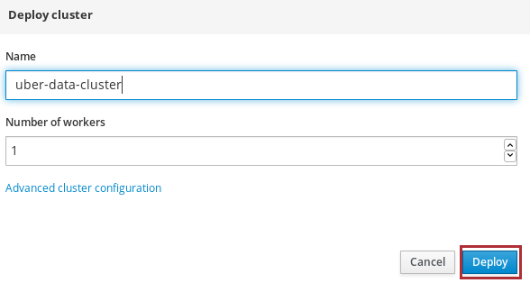

. Two `Deployment Config` resources will have been created.
These two DCs are responsible for the provisioning of the Oshinko Master and Worker.
These DCs are not configured with limits and requests as required by your lab environment.
Execute the following series of steps to add limits and requests to your DCs so that the underlying pods will start:

.. Add limits and requests to the master pod:
+
-----
$ oc patch dc/uber-data-cluster-m -n $OCP_USERNAME-uber-data \
    --patch '{"spec":{"strategy":{"resources": { "limits":{"cpu": "2","memory": "4Gi"},"requests":{"cpu":"1","memory":"512Mi"}   } }}}'

$ oc patch dc/uber-data-cluster-m -n $OCP_USERNAME-uber-data \
    --patch '{"spec":{"template":{"spec":{"containers":[{"name":"uber-data-cluster-m", "resources": {   "limits":{"cpu": "1","memory": "2Gi"},"requests":{"cpu":"500m","memory":"256Mi"}   }}]}}}}'
-----

.. Add limits and requests to the worker pod:
+
-----
$ oc patch dc/uber-data-cluster-w -n $OCP_USERNAME-uber-data \
   --patch '{"spec":{"strategy":{"resources": { "limits":{"cpu": "2","memory": "4Gi"},"requests":{"cpu":"1","memory":"512Mi"}   } }}}'

$ oc patch dc/uber-data-cluster-w -n $OCP_USERNAME-uber-data \
       --patch '{"spec":{"template":{"spec":{"containers":[{"name":"uber-data-cluster-w", "resources": {   "limits":{"cpu": "1","memory": "2Gi"},"requests":{"cpu":"500m","memory":"256Mi"}   }}]}}}}'
-----

.. The end result are the new Oshinko master and worker pods having started:
+
-----
$ oc get pods
NAME                          READY     STATUS      RESTARTS   AGE
...

uber-data-cluster-m-2-b4cl4   1/1       Running     0          1m
uber-data-cluster-w-2-678fp   1/1       Running     0          10s
-----

== Zeppelin

=== Overview
A completely open web-based notebook that enables interactive data analytics. Apache Zeppelin is a new and incubating multi-purposed web-based notebook which brings data ingestion, data exploration, visualization, sharing and collaboration features to Hadoop and Spark.

Interactive browser-based notebooks enable data engineers, data analysts and data scientists to be more productive by developing, organizing, executing, and sharing data code and visualizing results without referring to the command line or needing the cluster details. Notebooks allow these users not only allow to execute but to interactively work with long workflows.  There are a number of notebooks available with Spark. iPython remains a mature choice and great example of a data science notebook.  The Hortonworks Gallery provides an Ambari stack definition to help our customers quickly set up iPython on their Hadoop clusters.

Apache Zeppelin is a new and upcoming web-based notebook which brings data exploration, visualization, sharing and collaboration features to Spark.   It support Python, but also a growing list of programming languages such as Scala, Hive, SparkSQL, shell and markdown.

=== Architecture

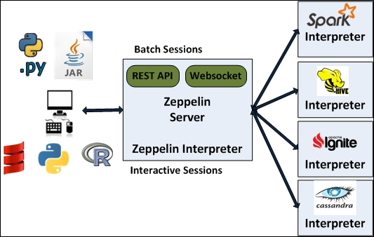

Frontend: This provides UI and shells to interact with humans and a display system to show data in tabular, graphical form, and export iframe.

Zeppelin Server: This provides web sockets and the REST API to interact with the UI and access service remotely. There are two types of API calls—a REST API for notebooks and an Interpreter API for interpreters. The Notebook REST API is to interact with notebooks—creating paragraph, submitting paragraph job in batch, adding cron jobs, and so on. The Interpreter REST API is to change the configuration properties and restart the interpreter.

Pluggable Interpreter System: This is to interact with different interpreters such as Spark, Shell, Markdown, AngularJS, Hive, Ignite, Flink, and others.

Interpreters: Each interpreter runs in a separate JVM to provide the functionality needed by the user.

=== Provision

. If you are not already there, switch to the OCP project specific to this lab:
+
-----
$ oc project $OCP_USERNAME-uber-data
-----

. In your OpenShift namespace, create the needed zeppelin templates:
+
-----
$ oc create \
     -f https://raw.githubusercontent.com/gpe-mw-training/operational_intelligence/1.0.4/templates/zeppelin-openshift.yaml \
     -n $OCP_USERNAME-uber-data

     ...
     template "apache-zeppelin-openshift" created

-----

. Review the templates that have been created:
+
-----
$ oc get templates -n $OCP_USERNAME-uber-data

-----

. Provision the Zeppelin web-ui
+
-----
$ oc new-app --template=apache-zeppelin-openshift \
  --param=APPLICATION_NAME=apache-zeppelin \
  --param=GIT_URI=https://github.com/rimolive/zeppelin-openshift.git \
  --param=ZEPPELIN_INTERPRETERS=md \
  >> /tmp/zeppelin-web.txt
-----
.. Review the output found in `/tmp/zeppelin-web.txt`
+
-----

....

--> Deploying template "user3-uber-data/apache-zeppelin-openshift" to project user3-uber-data

     * With parameters:
        * Application Name=apache-zeppelin
        * Git Repository URL=https://github.com/rimolive/zeppelin-openshift.git
        * Zeppelin Interpreters=md

--> Creating resources ...
    deploymentconfig "apache-zeppelin" created
    service "apache-zeppelin" created
    service "apache-zeppelin-headless" created
    route "apache-zeppelin" created
    buildconfig "apache-zeppelin" created
    imagestream "apache-zeppelin" created
    imagestream "zeppelin-openshift" created
--> Success
    Access your application via route 'apache-zeppelin-user3-uber-data.apps.6d13.openshift.opentlc.com'
    Build scheduled, use 'oc logs -f bc/apache-zeppelin' to track its progress.
    Run 'oc status' to view your app.

-----

.. Expect that a apache-zeppelin build pod run to completion from which the apache-zeppelin deployment will start:
+
-----
$ oc get pods -w

NAME                      READY     STATUS      RESTARTS   AGE
apache-zeppelin-1-build   0/1       Completed   0          2m
apache-zeppelin-1-tf9g8   1/1       Running     0          36s

-----
.. Apache Zeppelin Secured Route
+

-----

$ oc create route edge --service=apache-zeppelin

route "apache-zeppelin" created

-----

..  Why we are doing this above step?

As apache-zeppelin internally uses WebSocket to communicate,
But due to firewall block, Hence we are making it to as a secured route to communicate.
This is a temporary workaround solution. In General, we can use the *http* communication which is always recommended.

==== Login into Zeppelin UI

Navigate your browser to the output of the following URL:

-----
$ echo -en "\n\nhttps://"$(oc get route/apache-zeppelin -o template --template {{.spec.host}} -n $OCP_USERNAME-uber-data)/"\n\n"
-----

image::images/zeppelin.png[uberstream7]

== Zeppelin Interpreter

=== Overview

Zeppelin Interpreters are plug-ins which allow for specific languages and data-processing-backends.
For example, to use Scala code in Zeppelin, the Spark interpreter is needed.
If you chose to write your data analytics code in Python, the the PySpark would be an option for you.

In this section of the lab, you will run various Uber related data analysis _paragraphs_ as part of a Zeppelin Notebook.

These paragraphs are written in Scala and subsequently will run in a Spark Interpreter.

=== Inject Uber historical data

In this section of the lab, the raw uber related data found in your lab assets will be mounted to your Apache Zeppelin interpreter.
By keeping the data local to the Zeppelin interpreter, the data analysis will execute quickly.

. Create a configuration map based on the uber.csv data file found in your lab assets:
+
-----
$ oc create configmap uber-data-cm \
    --from-file=$HOME/lab/operational_intelligence/uber-data-analysis/src/main/resources/data/uber.csv
-----

. Mount the config map to the `apache-zeppelin` deployment config as a volume:
+
-----
$ oc set volume dc/apache-zeppelin \
         --add --overwrite \
         --name=uber-data-volume \
         -t configmap \
         --configmap-name=uber-data-cm \
         -m /data/uber.csv \
         --sub-path=uber.csv \
         --default-mode=0644
-----

. Mount the same config map to the Spark worker deployment config as a volume:
+
-----
$ oc set volume dc/uber-data-cluster-w  \
         --add --overwrite \
         --name=uber-data-volume \
         -t configmap \
         --configmap-name=uber-data-cm \
         -m /data/uber.csv \
         --sub-path=uber.csv \
         --default-mode=0644
-----

=== Port(s) and protocols

The Spark Master and Worker pods need to be configured to communicate with each other along with the Zeppelin Interpreter.

In this section you will use the Zeppelin UI to make these configuration changes.

. Ensure that you have apache-zeppelin having this kind of configuration as shown in the given below figure.
+
----
$ oc get services apache-zeppelin

NAME              TYPE        CLUSTER-IP      EXTERNAL-IP   PORT(S)                        AGE
apache-zeppelin   ClusterIP   172.30.43.201   <none>        8080/TCP,42000/TCP,42100/TCP   4m

----
+
Notice the Service 42000 has been exposed to spark.driver.port and 42100 has been exposed spark.driver.blockManager.port

. In the Zeppelin UI, open the Zeppelin UI by navigating to the drop down at the top right corner.
. From the drop down, select:  `Interpreter`.
. Scroll down to the `Spark` section and you should see configurations similar to the following:
+
image::images/ZeppelinNewSettings.png[]

. Make the following changes in this Spark section:

.. Find the existing text box for the URL to the `master` and populate it as follows:
+
-----
master                         : spark://uber-data-cluster:7077
-----

.. Scroll down to the bottom of the Spark section and add the following new text fields:

... *spark.driver.bindAddress*       :  0.0.0.0
... *spark.driver.host*              :	apache-zeppelin
... *spark.driver.blockManager.port* :	42100
... *spark.driver.port*	             :  42000

. After making the changes, scroll to the bottom of the page and click: `Save`.

. Deployment Topology given below.

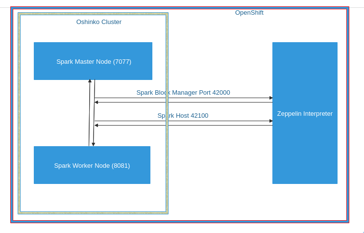

=== Creation of Uber NoteBook

Recall that the lab assets provided as Main.scala.

This application is currently running on Zeppelin Notebook. Let us explore what it does.

... Load the Data (Uber.csv) into the DataFrame.
+
image::images/LoadData1.png[LoadData]
... What is Feature Array?

Features of the array data type.
The amount of memory required to represent an array value is usually proportional to its cardinality, and not to the maximum cardinality of its type.
When an array is being referenced, all of the values in the array are stored in main memory.

... Define Feature Array.
In order for the features to be used by a machine learning algorithm, the features are transformed and put into Feature Vectors, which are vectors of numbers representing the value for each feature. Below, a VectorAssembler is used to transform and return a new DataFrame with all of the feature columns in a vector column.
+
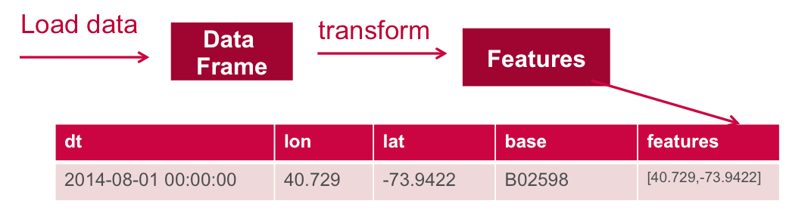
... Next, we create a KMeans object, set the parameters to define the number of clusters and the maximum number of iterations to determine the clusters, and then we fit the model to the input data
+
image::images/KMeansModel.png[FeatureArray]

... Next, we use the model to get the clusters for test data in order to further analyze the clustering.
+
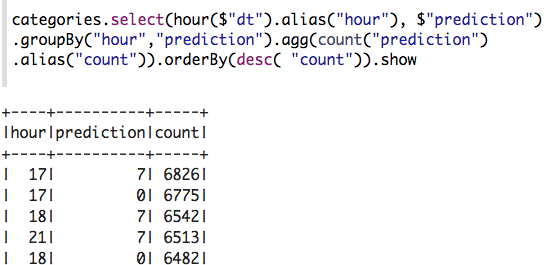

=== Import Uber _NoteBook_

It is the Source code and Output file that every students expected to Run and visualize the results.

.. Once the data copied, Open the Zeppelin URL using the URL determined in the previous section:
+
-----
$ echo -en "\n\nhttps://"$(oc get route/apache-zeppelin -o template --template {{.spec.host}} -n $OCP_USERNAME-uber-data)/"\n\n"
-----

.. Import the JSON File given the GitHub URL in the Zeppelin Notebook.

*You can import anyone of them*

.  https://raw.githubusercontent.com/gpe-mw-training/operational_intelligence/master/uber-data-analysis/notebooks/Uberwithoutput.json
.  https://raw.githubusercontent.com/gpe-mw-training/operational_intelligence/master/uber-data-analysis/notebooks/Uberlatest.json
+
image::images/UberImport.png[uberstream8]

.. You can change the directory structure in zeppelin notebook pointing to the data directory in POD.
   You can Edit the Zeppelin Paragraph and change the Directory Structure to */data/uber.csv*.
   All Paragraphs are editable in Zeppelin Notebook.
.. *Why we are doing this?*
   We need to import the data into the Spark Master Node into the Mounted Volume /data/uber.csv which locates the file to get loaded into the Memory and also it gives the advantage of Data Locality Principle.
+
image::images/ReadCSV.png[ReadCSV]
+
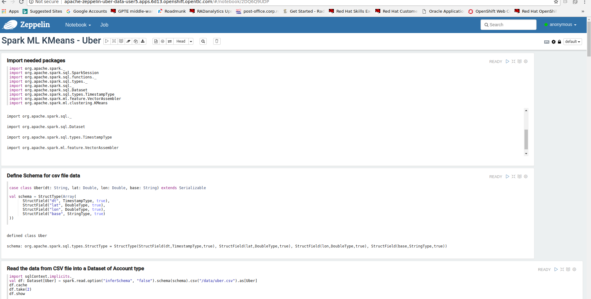

=== Execute Uber _Paragraphs_

.. It is an Important phase in the Lab2, Students are expected to run these each paragraphs. Careful attention and Execution is need in this phase.
.. Execute the cell at very stages and you can visualize the data, upon each query, Output will be cleared in the Zeppelin Notebook and the Students are expected to generate the output.
.. General MLFlow Pipeline in Apache Spark
+
image::images/bcmlprocess.png[SparkMLFlow]

.. Import the Required Packages. Scala Import Statements to use the Spark API and Dependent Libraries.
+
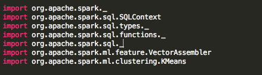

.. Define StructType - Since the Data uber.csv is a raw data, we need to define them in the form of Structural Schema. Hence we are using StructType Class from SparkAPI to convert them into Structural Schema.
.. Why we are doing this - SparkSQL deals with structural schema very easily as we can register with Temp tables in the Memory and can retrieve the data faster.
+
image::images/StructuredSchema.png[ss]

.. Load the Data into DataFrames.
.. A DataFrame is a distributed collection of data, which is organized into named columns. Conceptually, it is equivalent to relational tables with good optimization techniques.
+
image::images/LoadCSV.png[ls]

.. What is StructuralSchema?
... Since the UberData is in Raw Format (CSV), it is advised to convert into Structural Schema, where we can define a basic StructType.
    StructType is an object that defines the schema of Spark DataFrames.
    StructType objects contain a list of StructField objects that define the name, type, and nullable flag for each column in a DataFrame.
.. What is in the DataSets?
  The Data Set Schema
  Date/Time: The date and time of the Uber pickup.
  Lat: The latitude of the Uber pickup.
  Lon: The longitude of the Uber pickup.
  Base: The TLC base company affiliated with the Uber pickup.

​  ​The Data Records are in CSV format. An example line is shown below:

  2014-08-01 00:00:00,40.729,-73.9422,B02598

.. PrintStructuralSchema and Display the StructuralSchema.
+
image::images/StructuralSchema.png[structuralschema]
.. In this step we are printing Structural Schema to view the output on how the data (uber.csv) is placed. Also, we are caching the data in the spark Memory for faster data retrieval operations.
+
image::images/dfShow.png[df]
.. Define Feature Array.
... Features of the array data type. Therefore, arrays that contain a large amount of data will consume large amounts of main memory. Array element values can be retrieved by specifying the element's corresponding index value. Array data types are useful when you want to store a set of values of a single data type.
.. Why Feature Array is needed?
... Feature Array is the process of using domain knowledge to choose which data metrics to input as features into a machine learning algorithm. Feature Array plays a key role in K-means clustering; using meaningful features that capture the variability of the data is essential for the algorithm to find all of the naturally-occurring groups.
... Categorical data (i.e., category labels such as gender, country, browser type) needs to be encoded or separated in a way that can still work with the algorithm.
+
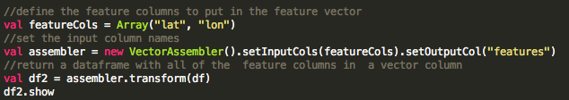
.. From a DataStructures point of Visualization of FeatureArray.
+
image::images/df2business.png[dfb]
.. Clustering uses unsupervised algorithms, which do not have the outputs (labeled data) in advance.
.. KMeans is one of the most commonly used clustering algorithms that clusters the data points into a predefined number of clusters (k). Clustering using the K-means algorithm begins by initializing all the coordinates to k number of centroids. With every pass of the algorithm, each point is assigned to its nearest centroid based on some distance metric, which is usually Euclidean distance. The centroids are then updated to be the “centers” of all the points assigned to it in that pass. This repeats until there is a minimum change in the centers.

.. Create a KMeans Object, Set the parameters to to define the number of clusters and the maximum number of iterations to determine the clusters, and then we fit the model to the input data.
+
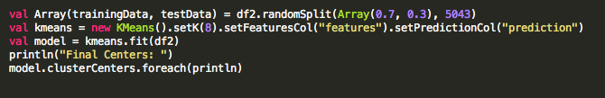
+
image::images/TransformBusiness.png[tfb]

.. Output of the ModelClusters.
+
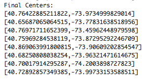

.. Cluster Centers are displayed in GoogleMap which is shown below
+
image::images/ClusterCenters.png[cc]

.. KMeans Functional Flow
+
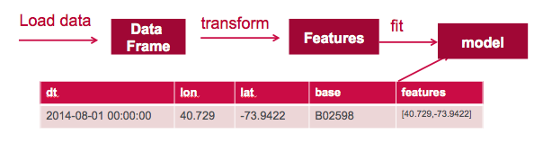

.. Now we can ask questions like, "Which hours of the day and which cluster had the highest number of pickups?"
+

.. How many Pickups occured in Each Cluster?
+
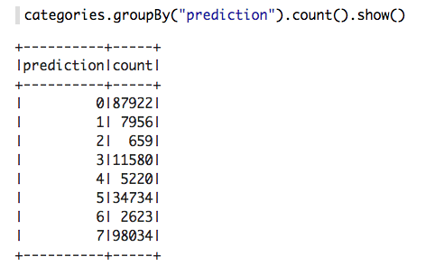
.. With a Zeppelin notebook, we can also display query results in bar charts or graphs. Below the x axis is the hour, the y axis the count, and the colors are the different clusters.
+
image::images/ZeppelinGraph.png[zg]
.. You can register a DataFrame as a temporary table using a given name, for example: df.registerTempTable("uber") , and then run SQL statements using the SQL methods provided by sqlContext. An example is shown below in a Zeppelin notebook.
+
image::images/TempTable.png[tt]
+
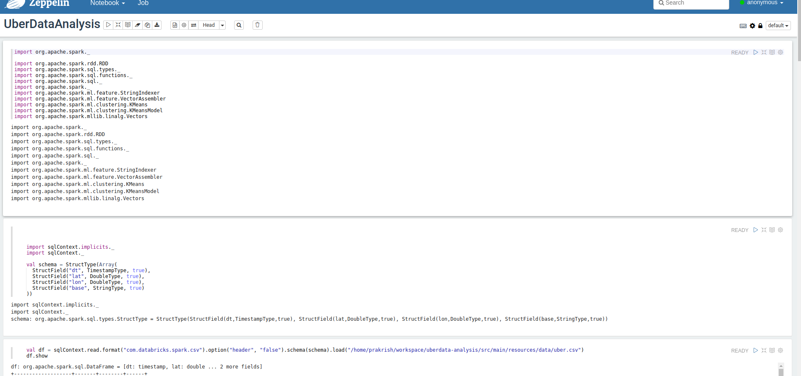

== Conclusions

====  What did we learn?

Oshinko Cluster - Cluster Management Solution for Apache Spark.

Apache Spark - Basics of Apache Spark like Actions and Transformations.

Apache Zeppelin NoteBook - Usage of Interactive Notebooks like Zeppelin and it's interaction with Oshinko Cluster for Apache Spark in a current Big Data scenario.

SparkSQL - Excellent API for structured streaming and it is an advanced concept in Apache Spark. Since, it uses catalyst optimizer, it provides an excellent performance benefits and it is the most prefered query language for the datascientists all over the world.

== Questions

TO-DO :  questions to test student knowledge of the concepts / learning objectives of this lab

== Appendix

=== Background

According to Gartner, by 2020, a quarter of a billion connected cars will form a major element of the Internet of Things. Connected vehicles are projected to generate 25GB of data per hour, which can be analyzed to provide real-time monitoring and apps, and will lead to new concepts of mobility and vehicle usage. One of the 10 major areas in which big data is currently being used to excellent advantage is in improving cities. For example, the analysis of GPS car data can allow cities to optimize traffic flows based on real-time traffic information.

Uber is using big data to perfect its processes, from calculating Uber’s pricing, to finding the optimal positioning of cars to maximize profits. In this series of blog posts, we are going to use public Uber trip data to discuss building a real-time example for analysis and monitoring of car GPS data. There are typically two phases in machine learning with real-time data:

Data Discovery: The first phase involves analysis on historical data to build the machine learning model.

Analytics Using the Model: The second phase uses the model in production on live events. (Note that Spark does provide some streaming machine learning algorithms, but you still often need to do an analysis of historical data.)building the model.

image:images/1.jpg[uberstream]

In this first post, I’ll help you get started using Apache Spark’s machine learning K-means algorithm to cluster Uber data based on location.

=== Where do we get these DataSets?

http://data.beta.nyc/dataset/uber-trip-data-foiled-apr-sep-2014

ifdef::showscript[]

=== ClusterQuota and Limit Range for Zeppelin Interpreter

==== Cluster Quota
A resource quota, defined by a ResourceQuota object, provides constraints that limit aggregate resource consumption per project. It can limit the quantity of objects that can be created in a project by type, as well as the total amount of compute resources and storage that may be consumed by resources in that project.

==== Limit Range
A limit range, defined by a LimitRange object, enumerates compute resource constraints in a project at the pod, container, image, image stream, and persistent volume claim level, and specifies the amount of resources that a pod, container, image, image stream, or persistent volume claim can consume.

All resource create and modification requests are evaluated against each LimitRange object in the project. If the resource violates any of the enumerated constraints, then the resource is rejected. If the resource does not set an explicit value, and if the constraint supports a default value, then the default value is applied to the resource.

By default, all OCP projects are assigned a limit range.  the limit range assigns default limits and requests for both CPU and RAM if the DCs themselves don't specify limits and requests.
The default CPU limit is set to 1/20th of a CPU.  So Spark was running on 1/20th of a CPU.

In general, all of us should always understand the details of LimitRanges assigned to our projects.
And its very likely that we should be adding/tweaking the limits and requests in our DC's.

==== CPU Limits

Each container in a pod can specify the amount of CPU it is limited to use on a node. CPU limits control the maximum amount of CPU that your container may use independent of contention on the node. If a container attempts to exceed the specified limit, the system will throttle the container. This allows the container to have a consistent level of service independent of the number of pods scheduled to the node.

==== Memory Requests
By default, a container is able to consume as much memory on the node as possible. In order to improve placement of pods in the cluster, specify the amount of memory required for a container to run. The scheduler will then take available node memory capacity into account prior to binding your pod to a node. A container is still able to consume as much memory on the node as possible even when specifying a request.

==== Memory Limits
If you specify a memory limit, you can constrain the amount of memory the container can use. For example, if you specify a limit of 200Mi, a container will be limited to using that amount of memory on the node. If the container exceeds the specified memory limit, it will be terminated and potentially restarted dependent upon the container restart policy.

=== Do we need to Know them
The above parameters are managed by the cluster Administrator and Infrastructure team, Hence it is not needed for the students to learn. But a basic concept of Knowing this will help.

*Students are expected to learn this much alone.*
----
For Viewing Quotas

$ oc get quota -n user3-uber-data
NAME                AGE
besteffort          11m
compute-resources   2m
object-counts       29m
...
...
$ oc describe quota object-counts -n user3-uber-data
Name:			object-counts
Namespace:		user3-uber-data
Resource		Used	Hard
--------		----	----
configmaps		3	10
persistentvolumeclaims	0	4
replicationcontrollers	3	20
secrets			9	10
services		2	10

For Viewing Limit Ranges

$ oc get limits -n user3-uber-data
NAME              AGE
resource-limits   6d

$ oc describe limits resource-limits
Name:		resource-limits
Namespace:	use3-uber-data
Type		Resource	Min	Max	Default Request	Default Limit	Max Limit/Request Ratio
----		--------	---	---	---------------	-------------	-----------------------
Pod		cpu		30m	2	-		-		-
Pod		memory		150Mi	1Gi	-		-		-
Container	memory		150Mi	1Gi	307Mi		512Mi		-
Container	cpu		30m	2	60m		1		-

$ oc describe limits resource-limits -n user3-uber-data
Name:                           resource-limits
Namespace:                      demoproject
Type                            Resource                Min     Max     Default Request Default Limit   Max Limit/Request Ratio
----                            --------                ---     ---     --------------- -------------   -----------------------
Pod                             cpu                     200m    2       -               -               -
Pod                             memory                  6Mi     1Gi     -               -               -
Container                       cpu                     100m    2       200m            300m            10
Container                       memory                  4Mi     1Gi     100Mi           200Mi           -
openshift.io/Image              storage                 -       1Gi     -               -               -
openshift.io/ImageStream        openshift.io/image      -       12      -               -               -
openshift.io/ImageStream        openshift.io/image-tags -       10      -               -               -

endif::showscript[]
