:noaudio:
:scrollbar:
:data-uri:
:toc2:
:linkattrs:

= Data Analytics Application Lab

.Goals

* Creation of a simple data analytics application using an IDE
* Deployment of the data analytics application to Oshinko cluster
* Execution of the data analytics application in Oshinko cluster

.Prerequisites

:numbered:

== Overview

== Lab Assets

. Git clone the assets. This should *NOT* be in your Virtual Machine.

---
 $ git clone https://github.com/gpe-mw-training/operational_intelligence.git

 $ cd operational_intelligence/simple-data-Analytics

---

== IDE Setup

. Download the RedHat Developer Studio from this link https://developers.redhat.com/products/devstudio/download/

== Data Analytics Application

=== Development

. Import as a Maven Project in RedHat-Developer-Studio.
+
image::images/MavenImport.png[import]

. Select where POM.xml file exists.
+
image::images/RootFolder.png[rootfolder]

. Enable the CheckBox of WorkingSets.
+
image::images/WorkingSets.png[ws]

. Run as Maven Build which will resolve the compilation errors.
+
image::images/MavenBuild.png[mb]
Enter the goal as
----
clean install package -e
----

. Run as Java Application pointing in SimpleDataAnalytics.java class on your IDE.

=== Analysing the Execution of code.

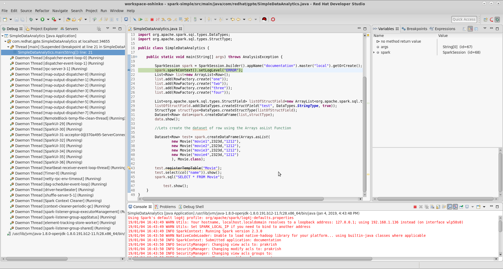

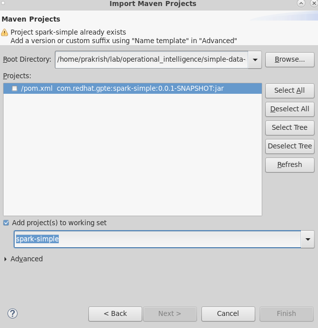

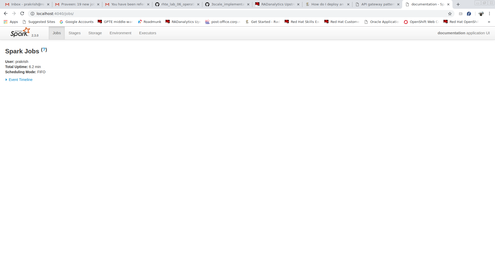

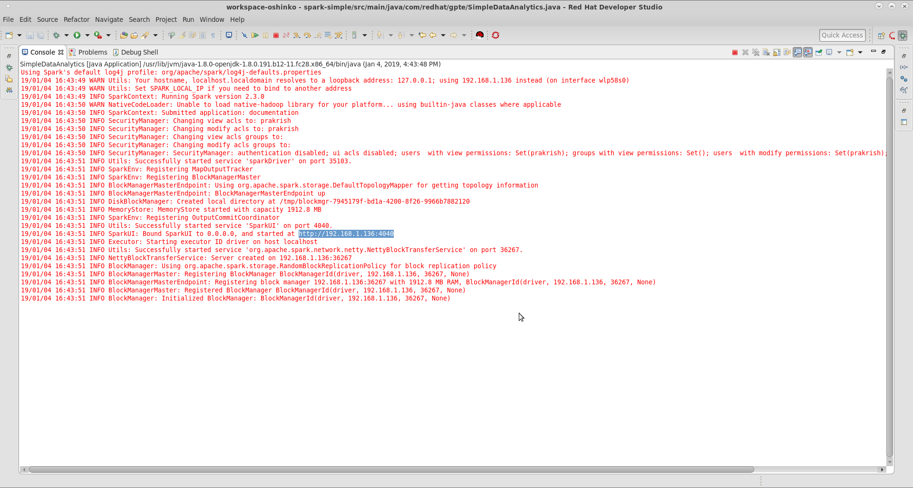

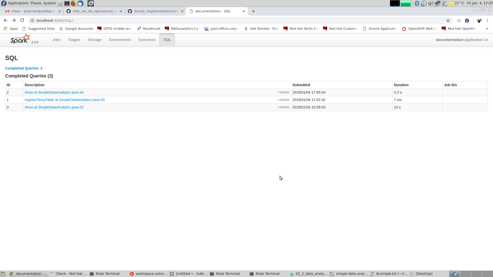

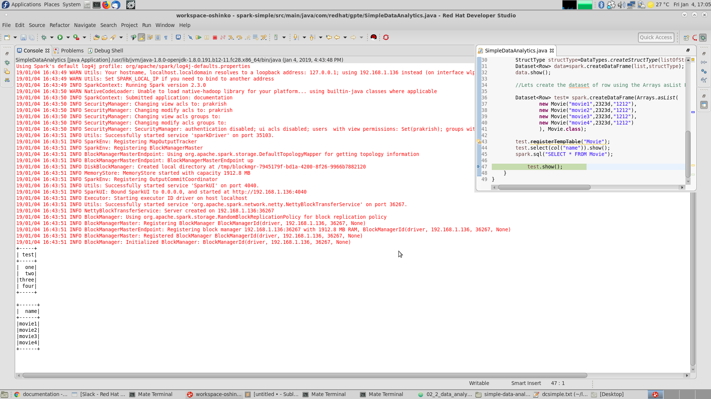

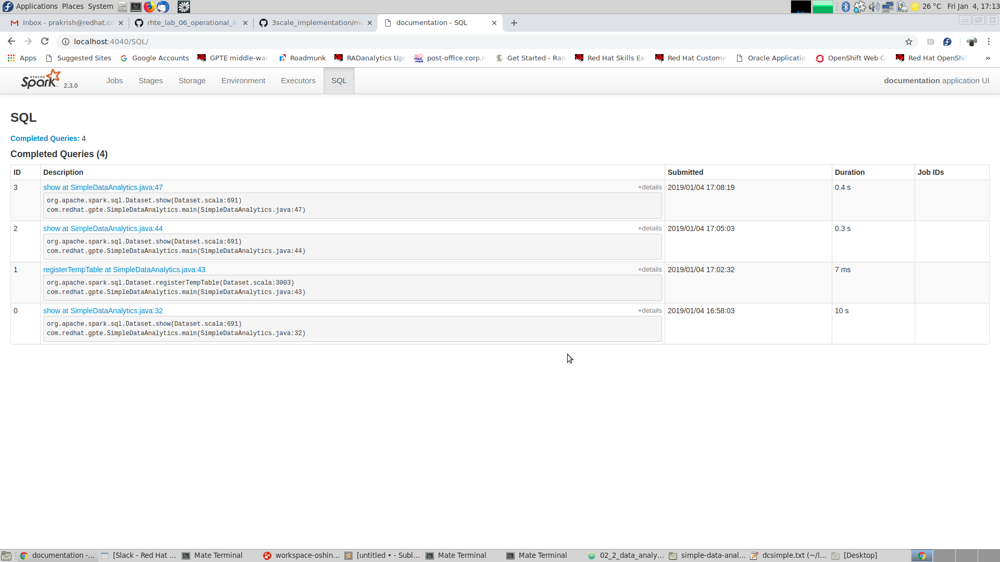

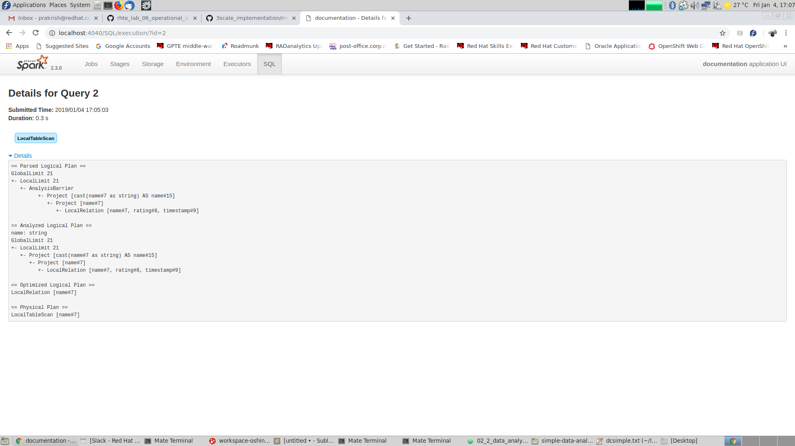

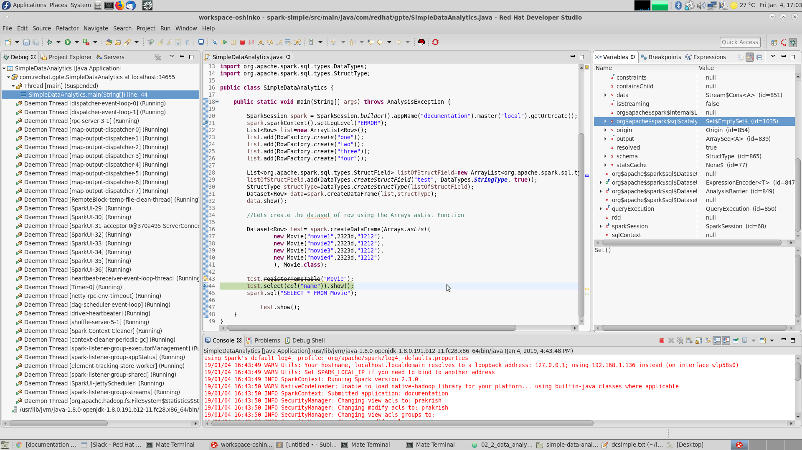

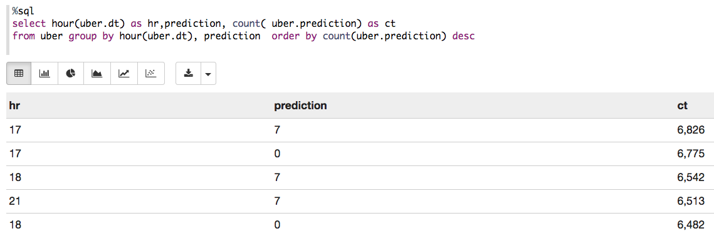

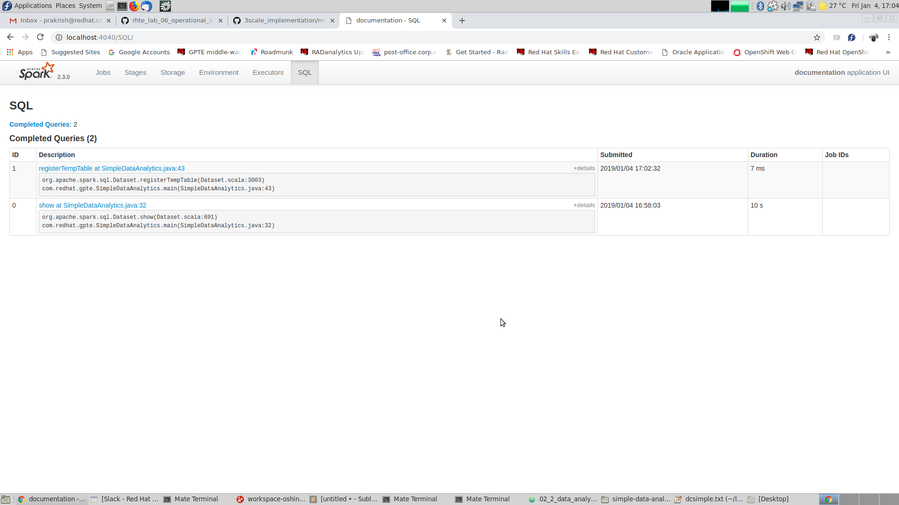

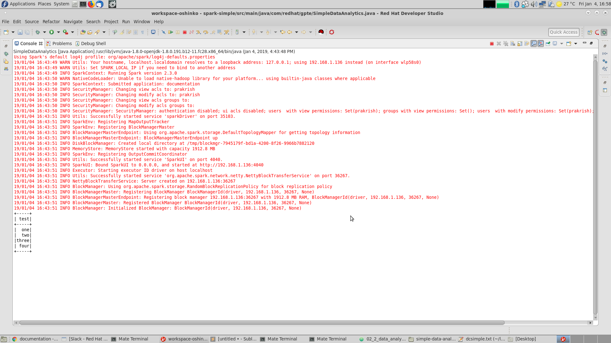

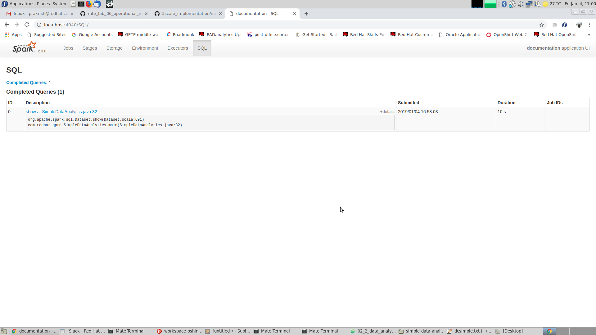

=== Deep Dive on the Code.
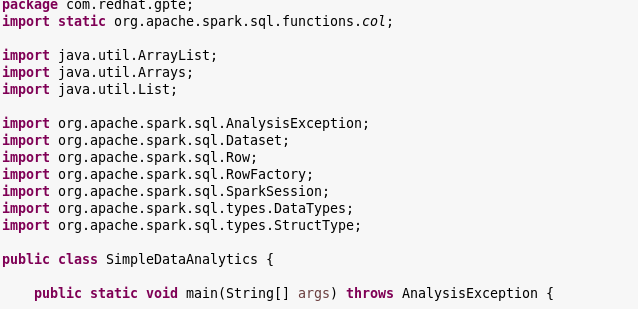

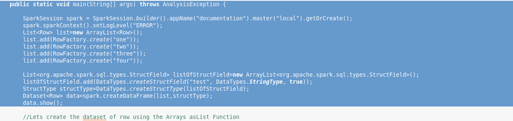

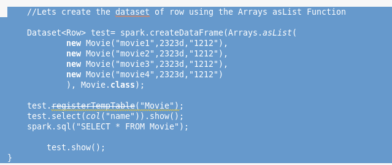

==== Actions and Transformations in Spark

==== Why SparkSQL is Chosen for DataAnalytics?

==== What are the Other Alternatives other than SparkSQL?

==== SparkUI

== Conclusions

=== What did we learn?

== Questions?

TO-DO :  questions to test student knowledge of the concepts / learning objectives of this lab

ifdef::showscript[]

endif::showscript[]
