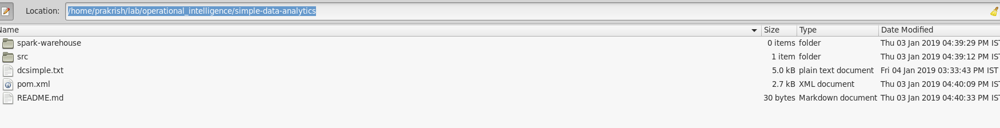
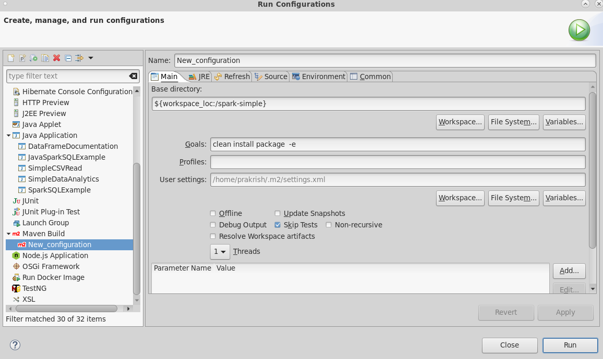

:noaudio:
:scrollbar:
:data-uri:
:toc2:
:linkattrs:

= Data Analytics Application Lab

.Goals

* Creation of a simple data analytics application using an IDE
* Deployment of the data analytics application to Oshinko cluster
* Execution of the data analytics application in Oshinko cluster

.Prerequisites

:numbered:

== Overview

== Lab Assets

. Git clone the assets. This should *NOT* be in your Virtual Machine.

---
 $ git clone https://github.com/gpe-mw-training/operational_intelligence.git

 $ cd operational_intelligence/simple-data-Analytics

---

== Creation of a simple data analytics application using an IDE.

=== IDE Setup

. Download the RedHat Developer Studio from this link https://developers.redhat.com/products/devstudio/download/

== Data Analytics Application

=== Development

. Import as a Maven Project in RedHat-Developer-Studio.
+
image::images/MavenImport.png[import]

. Select where POM.xml file exists.
+

. Enable the CheckBox of WorkingSets.
+
image::images/spark-simple.png[ws]

. Run as Maven Build which will resolve the compilation errors.
+

Enter the goal as
----
clean install package -e
----

. Run as Java Application pointing in SimpleDataAnalytics.java class on your IDE.

== Deployment of Data Analytics Application on Oshinko CLUSTER

=== What is Oshinko cluster?
The _Oshinko_ project covers several individual applications which all focus on the goal of deploying and managing Apache Spark clusters on Red Hat OpenShift Container Platform.

This Lab demonstrates the usage of an Oshinko cluster running in your OpenShift Container Platform environment.

=== Validate Environment Variables
In a previous lab, you should have already set various environment variables in the shell of your lab environment.

At this time, ensure that the following environment variables remain set:

-----
echo "export OCP_PROJECT=\$OCP_USERNAME-simple-data-analytics" >> ~/.bashrc

source ~/.bashrc

$ echo $OCP_USERNAME
developer

$ echo $OCP_PASSWD
xxxxxxxx
-----

== Lab Asset Overview

This lab provides a set of assets to assist with the provisioning of Oshinko and Zeppelin.
You will want to clone these lab assets to your lab environment so that you can review them.

. Make a new directory where all lab assets will reside.
  Already the lab assets are cloned in Lab1. Please refer instructions of Lab1.
. Change directory to the newly cloned project.
+
-----
$ cd $HOME/lab/operational_intelligence/
-----

. Review the various files specific to this lab :
+
-----
├── templates
│   ├── oshinko-cluster.yaml
│   ├── simple-data-analytics
│   ├── pom.xml
│   ├── README.md
│   └── src
│       └── main
│           ├── java
│           │   └── com
│           │       └── redhat
│           │           └── gpte
│           │               └── SimpleDataAnalytics.java
│           └── resources

-----

. Several key assets to review are as follows:

.. *pom.xml*
+
Notice that community Apache Spark and community Scala packages are being utilized.
At this time, Red Hat does not intend to provide supported versions of these packages.

.. *SimpleDataAnalytics.java*
+
The above class file is a simple hello world application which uses SparkSQL for performing some Query Operations and Analytics.
It is packaged as a Jar file and Deployed in our Oshinko Cluster. This code is developed in JBoss Developer Studio.

.. *Templates*

... *oshinko-cluster.yaml*
....  This template file use to create the deployment Objects of Oshinko Cluster and the students are expected to run for provisioning commands. Below given a detailed explaination of Oshinko Cluster provisioning.

== Oshinko
=== Overview

Oshinko is the project focused on providing a Spark cluster on OpenShift Container Platform.
In this section of the lab, you will provision Oshinko.

The Oshinko project covers several individual applications which all focus on the goal of deploying and managing Apache Spark clusters on Red Hat OpenShift and OpenShift Origin.
With the Oshinko family of applications you can create, scale, and destroy Apache Spark clusters. These clusters can then be used by your applications within an OpenShift project by providing a simple connection URL to the cluster. There are multiple paths to achieving this: browser based graphical interface, command line tool, and a RESTful server.

To begin your exploration, we recommend starting with the oshinko-webui application.

The oshinko-webui is a self-contained deployment of the Oshinko technologies.
An OpenShift user can deploy the oshinko-webui container into their project and then access the server with a web browser.
Through the browser interface you will be able to manage Apache Spark clusters within your project.
Once installed, it consists of a Node.JS application that is contained within a Pod and provides a web browser based user interface for controlling the lifecycle of Spark clusters.

Another important part of Oshinko to highlight is the oshinko-s2i repository and associated images which implement the source-to-image workflow for Apache Spark based applications. These images enable you to create full applications that can be built, deployed and upgraded directly from a source repository.

=== Oshinko Web UI

. Log into OpenShift Environment using OC Client Tool to your Lab Region
+
-----
$ oc login https://$HOSTNAME:8443 -u $OCP_USERNAME -p $OCP_PASSWD
-----

. Create and switch to the OCP project specific to this lab:
+
-----
$ oc new-project $OCP_USERNAME-simple-data-analytics --description=$OCP_USERNAME-simple-data-analytics

$ oc project $OCP_USERNAME-Simple-Data-Analytics
-----

. In your OpenShift namespace, create needed Oshinko templates:
+
-----
$ oc create \
     -f https://raw.githubusercontent.com/gpe-mw-training/operational_intelligence/1.0.3/templates/oshinko-cluster.yaml \
     -n $OCP_USERNAME-Simple-Data-Analytics
-----

. Provision the Oshinko-WebUI
+
-----

$ oc new-app oshinko-webui -n $OCP_USERNAME-simple-data-analytics > /tmp/oshinko-web.txt

-----
+
.. Review the output found in /tmp/oshinko-web.txt
+
----
--> Deploying template "user3-simple-data/oshinko-webui" to project user3-simple-data

     * With parameters:
        * SPARK_DEFAULT=
        * OSHINKO_WEB_NAME=oshinko-web
        * OSHINKO_WEB_IMAGE=radanalyticsio/oshinko-webui:stable
        * OSHINKO_WEB_ROUTE_HOSTNAME=
        * OSHINKO_REFRESH_INTERVAL=5

--> Creating resources ...
    service "oshinko-web-proxy" created
    service "oshinko-web" created
    route "oshinko-web" created
    deploymentconfig "oshinko-web" created
--> Success
    Access your application via route 'oshinko-web-user3-uber-data.apps.6d13.openshift.opentlc.com'
    Run 'oc status' to view your app.

----
. Review the template that has been created
+
-----
$ oc get template oshinko-webui -n $OCP_USERNAME-simple-data-analytics -o yaml | more
-----

. Wait until both containers of the oshinko-web pod have started:
+
-----
$ oc get pods -w
NAME                  READY     STATUS    RESTARTS   AGE

oshinko-web-1-86blg   2/2       Running   0
-----

. Log into the Oshinko web UI
.. Point your browser to the output of the following command:
+
-----
$ echo -en "\n\nhttp://"$(oc get route/oshinko-web -o template --template {{.spec.host}} -n $OCP_USERNAME-uber-data)/webui"\n\n"
-----
+
image::images/oshinko_homepage.png[]

.. At this time, the Oshinko web UI is not secured. It is recommended to use Oshinko webui non-secured port.
+
Subsequently, you should be able to access the UI without authenticating.

== Execution of Data Analytics Application on Oshinko CLUSTER
Via the OC Command Utility we can deploy this simple-data-analytics application using S2i Build tool.

.. The Command Line Arguments is given below :
+
-----
$ oc new-app --template oshinko-java-spark-build-dc \
    -p APPLICATION_NAME=spark-simple \
    -p APP_MAIN_CLASS=com.redhat.gpte.SimpleDataAnalytics \
    -p GIT_URI=https://github.com/Pkrish15/spark-simple \
    -p APP_FILE=spark-simple.jar
-----
+
.. Check the Build logs
-----
oc logs -f bc/spark-simple >>bcsimple.txt
-----

.. Check the Deployment logs
-----
oc logs -f dc/spark-simple >>dcsimple.txt

*Review the Output*

+ [[ /usr/local/s2i/run == *\/\u\s\r\/\l\o\c\a\l\/\s\2\i* ]]
+ exec /usr/local/s2i/run
oshinko v0.5.6
Default spark image: radanalyticsio/openshift-spark:2.3-latest
Didn't find cluster cluster-4a2bcb, creating ephemeral cluster
Using ephemeral cluster cluster-4a2bcb
Waiting for spark master http://cluster-4a2bcb-ui:8080 to be available ...
Waiting for spark master http://cluster-4a2bcb-ui:8080 to be available ...
Waiting for spark master http://cluster-4a2bcb-ui:8080 to be available ...
Waiting for spark master http://cluster-4a2bcb-ui:8080 to be available ...
Waiting for spark master http://cluster-4a2bcb-ui:8080 to be available ...
Waiting for spark master http://cluster-4a2bcb-ui:8080 to be available ...
Waiting for spark master http://cluster-4a2bcb-ui:8080 to be available ...
Waiting for spark workers (0/1 alive) ...
Waiting for spark workers (0/1 alive) ...
Waiting for spark workers (1/1 alive) ...
All spark workers alive
Cluster configuration is - Config:
    ExposeWebUI: "true"
    MastersCount: 1
    Metrics: "false"
    SparkImage: radanalyticsio/openshift-spark:2.3-latest
    WorkersCount: 1
  Ephemeral: spark-simple-1
  Image: radanalyticsio/openshift-spark:2.3-latest
  MasterUrl: spark://cluster-4a2bcb:7077
  MasterWebRoute: http://cluster-4a2bcb-ui-route-spark-hello-world.apps.na39.openshift.opentlc.com
  MasterWebUrl: http://cluster-4a2bcb-ui:8080
  Name: cluster-4a2bcb
  Namespace: spark-hello-world
  Status: Running
  href: /clusters/cluster-4a2bcb
spark-submit --class com.redhat.gpte.SimpleDataAnalytics --master spark://cluster-4a2bcb:7077 --conf spark.driver.host=spark-simple-headless /opt/app-root/src/spark-simple.jar
19/01/04 10:01:17 WARN NativeCodeLoader: Unable to load native-hadoop library for your platform... using builtin-java classes where applicable
19/01/04 10:01:17 INFO SparkContext: Running Spark version 2.3.0
19/01/04 10:01:17 INFO SparkContext: Submitted application: documentation
19/01/04 10:01:17 INFO SecurityManager: Changing view acls to: 1002560000
19/01/04 10:01:17 INFO SecurityManager: Changing modify acls to: 1002560000
19/01/04 10:01:17 INFO SecurityManager: Changing view acls groups to:
19/01/04 10:01:17 INFO SecurityManager: Changing modify acls groups to:
19/01/04 10:01:17 INFO SecurityManager: SecurityManager: authentication disabled; ui acls disabled; users  with view permissions: Set(1002560000); groups with view permissions: Set(); users  with modify permissions: Set(1002560000); groups with modify permissions: Set()
19/01/04 10:01:19 INFO Utils: Successfully started service 'sparkDriver' on port 40325.
19/01/04 10:01:19 INFO SparkEnv: Registering MapOutputTracker
19/01/04 10:01:19 INFO SparkEnv: Registering BlockManagerMaster
19/01/04 10:01:19 INFO BlockManagerMasterEndpoint: Using org.apache.spark.storage.DefaultTopologyMapper for getting topology information
19/01/04 10:01:19 INFO BlockManagerMasterEndpoint: BlockManagerMasterEndpoint up
19/01/04 10:01:19 INFO DiskBlockManager: Created local directory at /tmp/blockmgr-68d902a6-0efe-4c5b-9a8c-0c63faaff6a7
19/01/04 10:01:19 INFO MemoryStore: MemoryStore started with capacity 366.3 MB
19/01/04 10:01:19 INFO SparkEnv: Registering OutputCommitCoordinator
19/01/04 10:01:20 INFO Utils: Successfully started service 'SparkUI' on port 4040.
19/01/04 10:01:20 INFO SparkUI: Bound SparkUI to 0.0.0.0, and started at http://spark-simple-headless:4040
19/01/04 10:01:21 INFO SparkContext: Added JAR file:/opt/app-root/src/spark-simple.jar at spark://spark-simple-headless:40325/jars/spark-simple.jar with timestamp 1546596081143
19/01/04 10:01:21 INFO Executor: Starting executor ID driver on host localhost
19/01/04 10:01:21 INFO Utils: Successfully started service 'org.apache.spark.network.netty.NettyBlockTransferService' on port 34285.
19/01/04 10:01:21 INFO NettyBlockTransferService: Server created on spark-simple-headless:34285
19/01/04 10:01:21 INFO BlockManager: Using org.apache.spark.storage.RandomBlockReplicationPolicy for block replication policy
19/01/04 10:01:21 INFO BlockManagerMaster: Registering BlockManager BlockManagerId(driver, spark-simple-headless, 34285, None)
19/01/04 10:01:21 INFO BlockManagerMasterEndpoint: Registering block manager spark-simple-headless:34285 with 366.3 MB RAM, BlockManagerId(driver, spark-simple-headless, 34285, None)
19/01/04 10:01:21 INFO BlockManagerMaster: Registered BlockManager BlockManagerId(driver, spark-simple-headless, 34285, None)
19/01/04 10:01:21 INFO BlockManager: Initialized BlockManager: BlockManagerId(driver, spark-simple-headless, 34285, None)
+-----+
| test|
+-----+
|  one|
|  two|
|three|
| four|
+-----+

+------+
|  name|
+------+
|movie1|
|movie2|
|movie3|
|movie4|
+------+

+------+------+---------+
|  name|rating|timestamp|
+------+------+---------+
|movie1|2323.0|     1212|
|movie2|2323.0|     1212|
|movie3|2323.0|     1212|
|movie4|2323.0|     1212|
+------+------+---------+

Deleting cluster 'cluster-4a2bcb'
cluster "cluster-4a2bcb" deleted
-----

== Conclusions

=== What did we learn?
.. Creation of a simple data analytics application using an IDE
.. Deployment of the data analytics application to Oshinko cluster
.. Execution of the data analytics application in Oshinko cluster

== Questions?

TO-DO :  questions to test student knowledge of the concepts / learning objectives of this lab

== References

.  http://spark.apache.org/
.  http://spark.apache.org/examples.html
.  http://spark.apache.org/mllib/
.  https://jaceklaskowski.gitbooks.io/mastering-apache-spark/
.  https://www.amazon.in/Learning-Spark-Holden-Karau/dp/1449358624
.  https://spark.apache.org/sql/

ifdef::showscript[]
=== Analysing the Execution of code.
.. Put a Break Point nearer to the main method as shown in the below.
... Why we are doing this? In order to hold the Spark Session and explain in the code execution
+
image::images/Debug.png[debug]

image::images/spark-simple.png[sp]

image::images/SparkUI.png[spui]

image::images/OutputHighlightled.png[out]

image::images/sparkuisqltestshow.png[spts]

image::images/sqlquerycode.png[sql]

image::images/SQLUICompleted.png[sqlui]

image::images/tablescanui.png[ts]

image::images/temptable.png[tt]

image::images/TempTable.png[TT]

image::images/temptablesparkui.png[tts]

image::images/testshow.png[ts]

image::images/testshowsql.png[tss]

=== Deep Dive on the Code.
image::images/importstatements.png[is]

image::images/SparkSessionCode.png[ss]

image::images/SparkActionSQLCode.png[sasc]

==== Actions and Transformations in Spark

==== Why SparkSQL is Chosen for DataAnalytics?

==== What are the Other Alternatives other than SparkSQL?

==== SparkUI

endif::showscript[]
