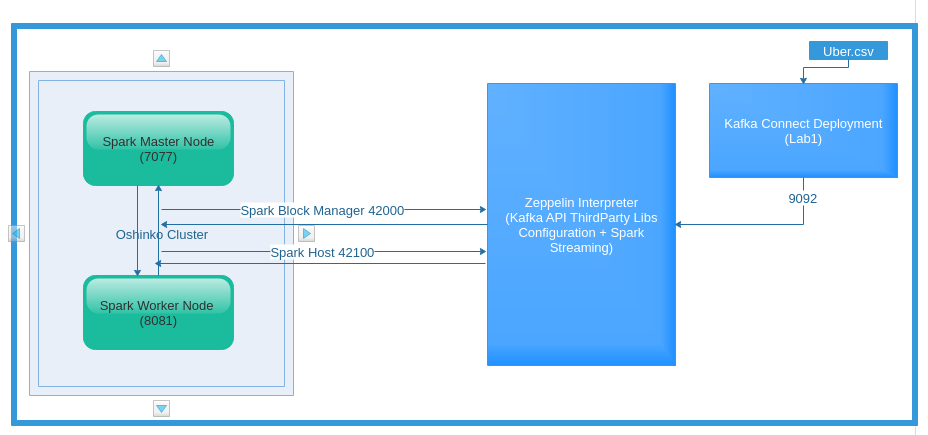
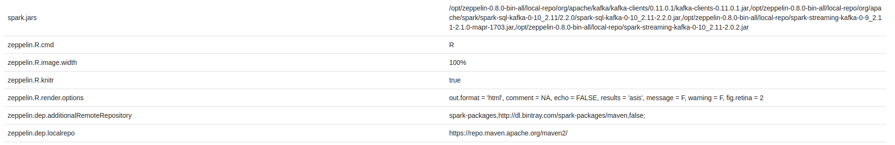
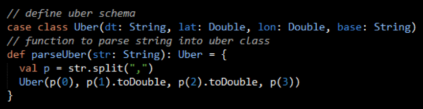
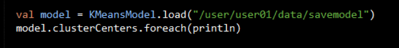
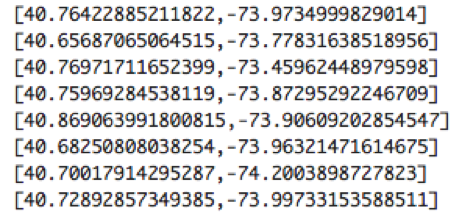
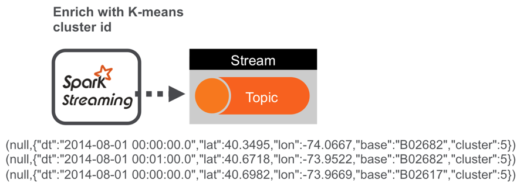
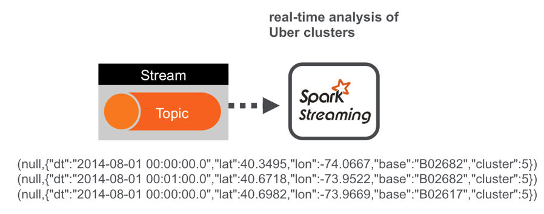
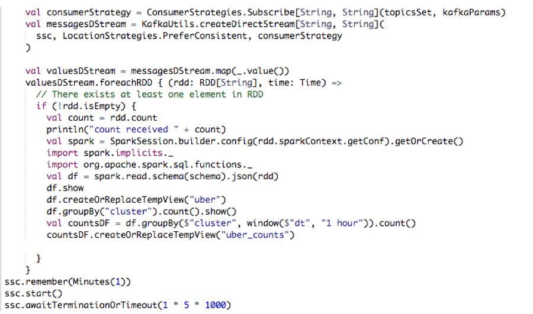
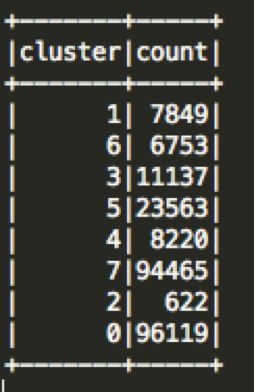

:noaudio:
:scrollbar:
:data-uri:
:toc2:
:linkattrs:

= Large Data Sets of Uber Data Analysis using Spark

.Prerequisite
* Skills
** Programming Knowledge of Python, Scala and Java Languages
** Knowledge of git
** Knowledge on OpenShift Deployments
** Basic Knowledge of Cluster Computing and Distributed Architectures

* Tools
** `curl` utility
** `sed` utility
** `oc` version 3.9 utility
** `Interactive Notebooks - Apache Zeppelin`
** `git` command basics

:numbered:

== Overview

=== Lab Goals
. Importing of a json file of traffic cluster centers
. Consumption of Uber data record stream via a Kafka Topic
. Enrichment of Uber data by assigning specific traffic cluster center Id to each record
. Publishing of Enriched Data records to a different Kafka Topic for additional downstream rule processing 

=== Technical Background

==== Apache Spark with Red Hat Strimzi Cluster

. *Apache Strimzi*
+
Strimzi provides a way to run an Apache Kafka cluster on Kubernetes or OpenShift in various deployment configurations.

. *KafkaAPI*

KafkaAPI is composed of Five Core API's which we need to know:

. The Producer API allows applications to send streams of data to topics in the Kafka cluster.
. The Consumer API allows applications to read streams of data from topics in the Kafka cluster.
. The Streams API allows transforming streams of data from input topics to output topics.
. The Connect API allows implementing connectors that continually pull from some source system or application into Kafka or push from Kafka into some sink system or application.
. The AdminClient API allows managing and inspecting topics, brokers, and other Kafka objects.

=== Architecture
. DataPipeLine Architecture Diagram.
+
Uber trip data is published to a Kafka Streams topic using the Kafka API. A Spark streaming application subscribed to the first topic: Ingests a stream of uber trip events Identifies the location cluster corresponding to the latitude and longitude of the uber trip Adds the cluster location to the event and publishes the results in JSON format to another topic A Spark streaming application subscribed to the second topic: Analyzes the uber trip location clusters that are popular by date and time.

image::images/DataFlowSchematic.png[DataFlow]

. Deployment Topology diagram with DataFlow.
+

=== Reference
.  https://kafka.apache.org/
.  https://strimzi.io/

=== Modify the Environment Variables
In a previous lab, you should have already set various environment variables in the shell of your lab environment.

At this time, ensure that the following environment variables remain reset:

-----
echo "export OCP_PROJECT=\$OCP_USERNAME-uber-realtime-data" >> ~/.bashrc

echo "export OCP_REGION=`echo $HOSTNAME | cut -d'.' -f2`" >> ~/.bashrc

echo "export OCP_DOMAIN=clientvm.\$OCP_REGION.rhte.opentlc.com" >> ~/.bashrc

echo "export OCP_WILDCARD_DOMAIN=apps.\$OCP_DOMAIN" >> ~/.bashrc

source ~/.bashrc

$ echo $OCP_USERNAME
developer

$ echo $OCP_PASSWD
xxxxxxxx
-----

== Lab Asset Overview

This lab provides a set of assets to assist with the provisioning of Oshinko and Zeppelin.
You will want to clone these lab assets to your lab environment so that you can review them.

. Make a new directory where all lab assets will reside.
  Already the lab assets are cloned in Lab1. Please refer instructions of Lab1.
. Change directory to the previously cloned lab asset.
+
-----
$ cd $HOME/lab/operational_intelligence/uber-realtime-spark-stream-analysis

-----

. Review the various files specific to this lab :
+
-----
uber-realtime-spark-stream-analysis/
├── data
│   ├── cluster.txt
│   └── uber.csv
├── notebooks
│   ├── ubernearrealtime.json
│  
├── pom.xml
├── ReadMe.adoc
└── src
    └── main
        ├── java
        │   └── com
        │       └── streamskafka
        │           └── uber
        │               ├── MsgConsumer.java
        │               └── MsgProducer.java
        └── scala
            └── com
                ├── sparkkafka
                │   └── uber
                │       ├── SparkKafkaConsumerProducer.scala
                └── sparkml
                    └── uber
                        ├── ClusterUber.scala
                        └── SqlUber.scala

-----

. Several key assets to review are as follows:

.. *pom.xml*
+
Notice that community Apache Spark and community Scala packages are being utilized.
At this time, Red Hat does not intend to provide supported versions of these packages.

.. *Large Datasets of Uber Data*

... Available in the lab assets at:  `uber-data-analysis/src/main/resources/data/uber.csv`
... It is the raw data from the UberData for NLC which describes the Latitude, Longitude, timestamp and BaseId

.. *SparkKafkaConsumerProducer.scala*

  ... Consumes the Uber.csv file which is a near-real-time-uber-data and send its to the UberTopic which has already been created in Lab1.
  ... Produces the Enriched UberData with KMeans clusterId which is send to the spark streaming which helps for accurate predictions.
 .. How Integration happening with Spark ?
 ... In Lab1 we create a topic called UberTopic which consumes the Uber.csv file and pushed into the spark-streaming. Please refer the deployment Topology diagram with Uber.csv file.

+
SparkkafkaConsumerProducer.scala is the code applied to the Zeppelin Notebook to analyze the data.

... This file is provided to you as background and context only.
For the purpose of this lab, you will not be modifying or compiling this scala class file.
... Compiling the SparkkafkaConsumerProducer.scala has already been done for you and the output being the exported asset introduced next:  _Uber.json_.

.. *UberNearRealTime.json*
+
... Later in this lab you will analyze this Uber.json.  It is generated from SCALA IDE or Using Zeppelin Paragraph Cells Compilation.
... Later in this lab you will import this JSON File in the Zeppelin NoteBook and run the each paragraph .

... *oshinko-cluster.yaml*
....  This template file use to create the deployment Objects of Oshinko Cluster and the students are expected to run for provisioning commands. Below given a detailed explaination of Oshinko Cluster provisioning.

... *zeppelin-openshift.yaml*

.... This template file use to create the deployment objects of Zeppelin and the students are expected to run for provisioning commands. Below given a detailed explaination of Zeppelin Provisioning and its interpreter Configurations.

== Kafka Strimzi Assets
Recall the OC commands created in Lab1.

== Oshinko

=== Oshinko Web UI

. Log into OpenShift Environment using OC Client Tool to your Lab Region
+
-----
$ oc login https://$HOSTNAME:8443 -u $OCP_USERNAME -p $OCP_PASSWD
-----

. Create and switch to the OCP project specific to this lab:
+
-----
$ oc new-project $OCP_USERNAME-uber-realtime-data --description=$OCP_USERNAME-uber-realtime-data

$ oc project $OCP_USERNAME-uber-realtime-data
-----

. In your OpenShift namespace, create needed Oshinko templates:
+
-----
$ oc create \
     -f https://raw.githubusercontent.com/gpe-mw-training/operational_intelligence/1.0.3/templates/oshinko-cluster.yaml \
     -n $OCP_USERNAME-uber-realtime-data
-----

. Provision the Oshinko-WebUI
+
-----

$ oc new-app oshinko-webui -n $OCP_USERNAME-uber-realtime-data > /tmp/oshinko-web.txt

-----
+
.. Review the output found in /tmp/oshinko-web.txt
+
----
--> Deploying template "developer-uber-realtime-data/oshinko-webui" to project developer-uber-realtime-data

     * With parameters:
        * SPARK_DEFAULT=
        * OSHINKO_WEB_NAME=oshinko-web
        * OSHINKO_WEB_IMAGE=radanalyticsio/oshinko-webui:stable
        * OSHINKO_WEB_ROUTE_HOSTNAME=
        * OSHINKO_REFRESH_INTERVAL=5

--> Creating resources ...
    service "oshinko-web-proxy" created
    service "oshinko-web" created
    route "oshinko-web" created
    deploymentconfig "oshinko-web" created
--> Success
    Access your application via route 'oshinko-web-user3-uber-data.apps.6d13.openshift.opentlc.com'
    Run 'oc status' to view your app.

----
. Review the template that has been created
+
-----
$ oc get template oshinko-webui -n $OCP_USERNAME-uber-realtime-data -o yaml | more
-----

. Wait until both containers of the oshinko-web pod have started:
+
-----
$ oc get pods -w
NAME                  READY     STATUS    RESTARTS   AGE

oshinko-web-1-86blg   2/2       Running   0
-----

. Log into the Oshinko web UI
.. Point your browser to the output of the following command:
+
-----
$ echo -en "\n\nhttp://"$(oc get route/oshinko-web -o template --template {{.spec.host}} -n $OCP_USERNAME-uber-realtime-data)/webui"\n\n"
-----
+
image::images/oshinko_homepage.png[oshinko_homepage]

.. At this time, the Oshinko web UI is not secured. It is recommended to use Oshinko webui non-secured port.
+
Subsequently, you should be able to access the UI without authenticating.

=== Oshinko Cluster
In a real-time scenario, we would have different clusters for each services and use cases. Hence, we are not going to use the same cluster which was used in Lab2. We are going to create a new cluster for Lab3.
Because of this cluster can act as an Independent services. Hence we are doing this.

Via the Oshinko Web UI, you can now create an Oshinko cluster which will consist of both a master and worker pods.

. In the homepage of the Oshinko Web UI, click: `Deploy`
. Populate the pop-up with the following:
.. *Name*: uber-realtime-data-cluster
.. *Number of workers*: 1
. Click the `Deploy` button
+
image::images/uberrealtimedatacluster.png[uberrealtimedatacluster]

. Two `Deployment Config` resources will have been created.
These two DCs are responsible for the provisioning of the Oshinko Master and Worker.
These DCs are not configured with limits and requests as required by your lab environment.
Execute the following series of steps to add limits and requests to your DCs so that the underlying pods will start:

.. Add limits and requests to the master pod:
+
-----
$ oc patch dc/uber-realtime-data-cluster-m -n $OCP_USERNAME-uber-realtime-data \
    --patch '{"spec":{"strategy":{"resources": { "limits":{"cpu": "2","memory": "4Gi"},"requests":{"cpu":"1","memory":"512Mi"}   } }}}'

$ oc patch dc/uber-realtime-data-cluster-m -n $OCP_USERNAME-uber-realtime-data \
    --patch '{"spec":{"template":{"spec":{"containers":[{"name":"uber-realtime-data-cluster-m", "resources": {   "limits":{"cpu": "1","memory": "2Gi"},"requests":{"cpu":"500m","memory":"256Mi"}   }}]}}}}'
-----

.. Add limits and requests to the worker pod:
+
-----
$ oc patch dc/uber-realtime-data-cluster-w -n $OCP_USERNAME-uber-realtime-data \
   --patch '{"spec":{"strategy":{"resources": { "limits":{"cpu": "2","memory": "4Gi"},"requests":{"cpu":"1","memory":"512Mi"}   } }}}'

$ oc patch dc/uber-realtime-data-cluster-w -n $OCP_USERNAME-uber-realtime-data \
       --patch '{"spec":{"template":{"spec":{"containers":[{"name":"uber-realtime-data-cluster-w", "resources": {   "limits":{"cpu": "1","memory": "2Gi"},"requests":{"cpu":"500m","memory":"256Mi"}   }}]}}}}'
-----

.. The end result are the new Oshinko master and worker pods having started:
+
-----
$ oc get pods
NAME                          READY     STATUS      RESTARTS   AGE
...

uber-realtime-data-cluster-m-2-b4cl4   1/1       Running     0          1m
uber-realtime-data-cluster-w-2-678fp   1/1       Running     0          10s
-----

== Zeppelin

=== Provision

. If you are not already there, switch to the OCP project specific to this lab:
+
-----
$ oc project $OCP_USERNAME-uber-realtime-data
-----

. In your OpenShift namespace, create the needed zeppelin templates:
+
-----
$ oc create \
     -f https://raw.githubusercontent.com/gpe-mw-training/operational_intelligence/1.0.4/templates/zeppelin-openshift.yaml \
     -n $OCP_USERNAME-uber-realtime-data

     ...
     template "apache-zeppelin-openshift" created

-----

. Review the templates that have been created:
+
-----
$ oc get templates -n $OCP_USERNAME-uber-realtime-data

-----

. Provision the Zeppelin web-ui
+
-----
$ oc new-app --template=apache-zeppelin-openshift \
  --param=APPLICATION_NAME=apache-zeppelin \
  --param=GIT_URI=https://github.com/gpe-mw-training/operational_intelligence.git \
  --param=ZEPPELIN_INTERPRETERS=md \
  >> /tmp/zeppelin-web.txt
-----
.. Review the output found in `/tmp/zeppelin-web.txt`
+
-----
--> Deploying template "developer-uber-realtime-data/apache-zeppelin-openshift" to project developer-uber-realtime-data

     * With parameters:
        * Application Name=apache-zeppelin
        * Git Repository URL=https://github.com/rimolive/zeppelin-openshift.git
        * Zeppelin Interpreters=md

--> Creating resources ...
    deploymentconfig "apache-zeppelin" created
    service "apache-zeppelin" created
    service "apache-zeppelin-headless" created
    route "apache-zeppelin" created
    buildconfig "apache-zeppelin" created
    imagestream "apache-zeppelin" created
    imagestream "zeppelin-openshift" created
--> Success
    Access your application via route 'apache-zeppelin-developer-uber-realtime-data.apps.6d13.openshift.opentlc.com'
    Build scheduled, use 'oc logs -f bc/apache-zeppelin' to track its progress.
    Run 'oc status' to view your app.
-----

.. Expect that a apache-zeppelin build pod run to completion from which the apache-zeppelin deployment will start:
+
-----
$ oc get pods -w

NAME                      READY     STATUS      RESTARTS   AGE
apache-zeppelin-1-build   0/1       Completed   0          2m
apache-zeppelin-1-tf9g8   1/1       Running     0          36s

-----

==== Login into Zeppelin UI

Navigate your browser to the output of the following URL:

-----
$ echo -en "\n\nhttp://"$(oc get route/apache-zeppelin -o template --template {{.spec.host}} -n $OCP_USERNAME-uber-realtime-data)/"\n\n"
-----

image::images/zeppelin.png[uberstream7]

== Zeppelin Kafka configurations
Apache Kafka is a third Party Library to Zeppelin, Hence we need to add kafka Libraries as a Maven Dependency in the Zeppelin UI.
Zeppelin will download it from Maven Repository and gets added as an application jar file.
Two steps we have to perform in the Spark Interpreter

----
zeppelin.dep.localrepo             :  	https://repo.maven.apache.org/maven2/
spark.jars                         :    /opt/zeppelin/notebook/thirdpartyjars/<pick-up-the-jar-files>
----
==== Zeppelin ClassPath

Also in the zeppelin paragraph, we must include these below code, which will get added as a Dependency in Zeppelin ClassPath.
This will resolve our dependency issues and compilation problems.

----
%spark.dep
z.addRepo("mapr-releases").url("http://repository.mapr.com/maven/")
z.load("org.apache.spark:spark-streaming-kafka-0-9_2.11:2.1.0-mapr-1703")
z.load("/opt/zeppelin/notebook/thirdpartyjars/spark-streaming-kafka-0-9_2.11-2.1.0-mapr-1703.jar")
z.load("/opt/zeppelin/notebook/thirdpartyjars/spark-streaming-kafka-0-10_2.11-2.0.2.jar")
z.load("/opt/zeppelin/notebook/thirdpartyjars/kafka-clients-2.0.0.jar")
z.load("/opt/zeppelin/notebook/thirdpartyjars/spark-streaming-kafka-producer_2.11-2.0.1-mapr-1703.jar")

----

=== Inject Uber RealTime data

In this section of the lab, the raw uber related data found in your lab assets will be mounted to your Apache Zeppelin interpreter.
By keeping the data local to the Zeppelin interpreter, the data analysis will execute quickly.

. Create a configuration map based on the uber.csv data file found in your lab assets:
+
-----
$ oc create configmap uber-realtime-data-cm \
    --from-file=$HOME/lab/operational_intelligence/uber-realtime-data-analysis/src/main/resources/data/uber.csv
-----

. Mount the config map to the `apache-zeppelin` deployment config as a volume:
+
-----
$ oc set volume dc/apache-zeppelin \
         --add --overwrite \
         --name=uber-realtime-data-volume \
         -t configmap \
         --configmap-name=uber-realtime-data-cm \
         -m /data/uber.csv \
         --sub-path=uber.csv \
         --default-mode=0644
-----

. Mount the same config map to the Spark worker deployment config as a volume:
+
-----
$ oc set volume dc/uber-realtime-data-cluster-w  \
         --add --overwrite \
         --name=uber-realtime-data-volume \
         -t configmap \
         --configmap-name=uber-realtime-data-cm \
         -m /data/uber.csv \
         --sub-path=uber.csv \
         --default-mode=0644
-----
. Mount the configmaps to the `apache-zeppelin` deployment config as a volume:
+
-----
$ oc set volume dc/apache-zeppelin \
         --add --overwrite \
         --name=uber-realtime-thirdparty-jars-cm1 \
         -t configmap \
         --configmap-name=uber-thirdparty-jars-cm1 \
         -m /data/uber.csv \
         --sub-path=uber.csv \
         --default-mode=0644
-----

=== Port(s),protocols and Kafka Configurations

The Spark Master and Worker pods need to be configured to communicate with each other along with the Zeppelin Interpreter.

Apache Kafka is a third Party Library to Zeppelin, Hence we need to add kafka Libraries as a Maven Dependency in the Zeppelin UI.
Zeppelin will download it from Maven Repository and gets added as an application jar file.

In this section you will use the Zeppelin UI to make these configuration changes.

. Ensure that you have apache-zeppelin having this kind of configuration as shown in the given below figure.
+
----
$ oc get services apache-zeppelin

NAME              TYPE        CLUSTER-IP      EXTERNAL-IP   PORT(S)                        AGE
apache-zeppelin   ClusterIP   172.30.43.201   <none>        8080/TCP,42000/TCP,42100/TCP   4m

----
+
Notice the Service 42000 has been exposed to spark.driver.port and 42100 has been exposed spark.driver.blockManager.port

. In the Zeppelin UI, open the Zeppelin UI by navigating to the drop down at the top right corner.
. From the drop down, select:  `Interpreter`.
. Scroll down to the `Spark` section and you should see configurations similar to the following:
+
image::images/ZeppelinNewSettings.png[]

. Make the following changes in this Spark section:

.. Find the existing text box for the URL to the `master` and populate it as follows:
+
-----
master                         : spark://uber-realtime-data-cluster:7077

zeppelin.dep.localrepo             :  	https://repo.maven.apache.org/maven2/
-----

.. Scroll down to the bottom of the Spark section and add the following new text fields:

... *spark.driver.bindAddress*       :  0.0.0.0
... *spark.driver.host*              :	apache-zeppelin
... *spark.driver.blockManager.port* :	42100
... *spark.driver.port*	             :  42000
... *spark.jars*                     :  <Manually add the Path of the Jar files which is placed in Kafka configuration screenshot>

. After making the changes, scroll to the bottom of the page and click: `Save`.

. Deployment Topology given below.
+
image::images/DeploymentTopologyLab3.png[DeploymentTopo]

. Deployment Topology with DataFlow.
+

. DataPipeLine Architecture Diagram.

Uber trip data is published to a Kafka Streams topic using the Kafka API.
A Spark streaming application subscribed to the first topic:
Ingests a stream of uber trip events
Identifies the location cluster corresponding to the latitude and longitude of the uber trip
Adds the cluster location to the event and publishes the results in JSON format to another topic
A Spark streaming application subscribed to the second topic:
Analyzes the uber trip location clusters that are popular by date and time.

image::images/DataFlowSchematic.png[DataFlow]

=== What we did in the Lab2?
In Lab2 we just created a model with the Historical data (Uber.csv), build a training set, Identified the patterns and did a Test Predictions.

In Lab3 we are going to use the Deployed Model and give accurate predictions.

image::images/picture1.png[recall]

=== Creation of Uber NoteBook

Recall that the lab assets provided as SparkProducerConsumer.scala.

This application is currently running on Zeppelin Notebook. Let us explore what it does.

... Incoming Data is in CSV format, get enriched with JSON Format and the KMeans Cluster ID is assigned to it.

+
image::images/picture3.png[LoadData]

+
image::images/picture4.png[KMeans]

+
image::images/picture5.png[KMeansClusterID]

... Parsing the Data Set Records
A Scala Uber case class defines the schema corresponding to the CSV records. The parseUber function parses the comma separated values into the Uber case class.

+

... Loading the K-Means Model
The Spark KMeansModel class is used to load the saved K-means model fitted on the historical Uber trip data.

+

.. Output of Model clusterCenters

+

... Next, we create a KMeans object, set the parameters to define the number of clusters and the maximum number of iterations to determine the clusters, and then we fit the model to the input data

+
image::images/picture9.png[FeatureArray]

... Next, we use the model to get the clusters for test data in order to further analyze the clustering.

=== Import Uber _NoteBook_

It is the Source code and Output file that every students expected to Run and visualize the results.

.. Once the data copied, Open the Zeppelin URL using the URL determined in the previous section:
+
-----
$ echo -en "\n\nhttp://"$(oc get route/apache-zeppelin -o template --template {{.spec.host}} -n $OCP_USERNAME-uber-realtime-data)/"\n\n"
-----

.. Import the JSON File given the GitHub URL in the Zeppelin Notebook

.  https://raw.githubusercontent.com/gpe-mw-training/operational_intelligence/master/uber-realtime-data-analysis/notebooks/Uber.json

+
image::images/UberImport.png[uberstream8]

.. You can change the directory structure in zeppelin notebook pointing to the data directory in POD.
   You can Edit the Zeppelin Paragraph and change the Directory Structure to */data/uber.csv*.
   All Paragraphs are editable in Zeppelin Notebook.
.. *Why we are doing this?*
   We need to import the data into the Spark Master Node into the Mounted Volume */data/uber.csv* which locates the file to get loaded into the Memory and also it gives the advantage of Data Locality Principle.

=== Execute Uber _Paragraphs_

.. *Spark Streaming Code*

These are the basic steps for the Spark Streaming Consumer Producer code:

... *Configure Kafka Consumer Producer properties*
.. Initialize a Spark StreamingContext object. Using this context, create a DStream which reads message from a Topic.
.. Apply transformations (which create new DStreams).
.. Write messages from the transformed DStream to a Topic.
.. Start receiving data and processing. Wait for the processing to be stopped.
.. We will go through each of these steps with the example application code.

... *Configure Kafka Consumer Producer properties*
.. The first step is to set the KafkaConsumer and KafkaProducer configuration properties, which will be used later to create a DStream for receiving/sending messages to topics. You need to set the following paramters:

.. Key and value deserializers: for deserializing the message.
.. Auto offset reset: to start reading from the earliest or latest message.
.. Bootstrap servers: this can be set to a dummy host:port since the broker address is not actually used by Kafka Streams.

... *Initialize a Spark StreamingContext Object*

.. ConsumerStrategies.Subscribe, as shown below, is used to set the topics and Kafka configuration parameters. We use the KafkaUtils createDirectStream method with a StreamingContext, the consumer and location strategies, to create an input stream from a Kafka Streams topic. This creates a DStream that represents the stream of incoming data, where each message is a key value pair. We use the DStream map transformation to create a DStream with the message values.

+
image::images/picture11.png[stream]

+
image::images/picture12.png[DStream]

.. Apply Transformations (Which create New DStreams)

.. We use the DStream foreachRDD method to apply processing to each RDD in this DStream. We parse the message values into Uber objects, with the map operation on the DStream. Then we convert the RDD to a DataFrame, which allows you to use DataFrames and SQL operations on streaming data.
+
image::images/picture13.png[code]

.. Here is the Output from the df.show

+
image::images/picture14.png[dfshow]

.. A VectorAssembler is used to transform and return a new DataFrame with the latitude and longitude feature columns in a vector column.

+
image::images/picture15.png[vectorAssemblerLoad]

+
image::images/picture16.png[VectorAssemblerCode]

.. Then the model is used to get the clusters from the features with the model transform method, which returns a DataFrame with the cluster predictions.

+
image::images/picture17.png[LoadModel]

.. Write messages from the transformed DStream to a Topic

+

.. The Dataset result of the query is converted to JSON RDD Strings, then the RDD sendToKafka method is used to send the JSON key-value messages to a topic (the key is null in this case).

+
image::images/picture21.png[jsonconversion]

+
image::images/picture22.png[dstreamRDD]

.. Start receiving the data and processing it. Wait for the process to be stopped.
To start receiving data, we must explicitly call start() on the StreamingContext, then call awaitTermination to wait for the streaming computation to finish.

+
image::images/picture23.png[processingdata]

.. *Spark Kafka Consumer Code*
Next, we will go over some of the Spark streaming code which consumes the JSON-enriched messages.

+

... *Below is the code for*

.. Creating a Direct Kafka Stream
.. Converting the JSON message values to Dataset[Row] using spark.read.json with the schema
.. Creating two temporary views for subsequent SQL queries
.. Using ssc.remember to cache data for queries

+

.. Output of the Cluster Centers

+

== Conclusions

====  What did we learn?

Apache Strimzi - Basics of Apache Strimzi and it's deployment on OpenShift.

Spark Streaming - Excellent API for structured streaming and it is an advanced concept in Apache Spark. Since, it uses catalyst optimizer, it provides an excellent performance benefits and it is the most prefered query language for the datascientists all over the world.

Kafka with Apache Spark Integration - We learned Apache Kafka integration with Spark on Zeppelin Notebook.

== Questions

TO-DO :  questions to test student knowledge of the concepts / learning objectives of this lab

== Appendix

=== Where do we get these DataSets?

http://data.beta.nyc/dataset/uber-trip-data-foiled-apr-sep-2014

ifdef::showscript[]

=== ClusterQuota and Limit Range for Zeppelin Interpreter

==== Cluster Quota
A resource quota, defined by a ResourceQuota object, provides constraints that limit aggregate resource consumption per project. It can limit the quantity of objects that can be created in a project by type, as well as the total amount of compute resources and storage that may be consumed by resources in that project.

==== Limit Range
A limit range, defined by a LimitRange object, enumerates compute resource constraints in a project at the pod, container, image, image stream, and persistent volume claim level, and specifies the amount of resources that a pod, container, image, image stream, or persistent volume claim can consume.

All resource create and modification requests are evaluated against each LimitRange object in the project. If the resource violates any of the enumerated constraints, then the resource is rejected. If the resource does not set an explicit value, and if the constraint supports a default value, then the default value is applied to the resource.

By default, all OCP projects are assigned a limit range.  the limit range assigns default limits and requests for both CPU and RAM if the DCs themselves don't specify limits and requests.
The default CPU limit is set to 1/20th of a CPU.  So Spark was running on 1/20th of a CPU.

In general, all of us should always understand the details of LimitRanges assigned to our projects.
And its very likely that we should be adding/tweaking the limits and requests in our DC's.

==== CPU Limits

Each container in a pod can specify the amount of CPU it is limited to use on a node. CPU limits control the maximum amount of CPU that your container may use independent of contention on the node. If a container attempts to exceed the specified limit, the system will throttle the container. This allows the container to have a consistent level of service independent of the number of pods scheduled to the node.

==== Memory Requests
By default, a container is able to consume as much memory on the node as possible. In order to improve placement of pods in the cluster, specify the amount of memory required for a container to run. The scheduler will then take available node memory capacity into account prior to binding your pod to a node. A container is still able to consume as much memory on the node as possible even when specifying a request.

==== Memory Limits
If you specify a memory limit, you can constrain the amount of memory the container can use. For example, if you specify a limit of 200Mi, a container will be limited to using that amount of memory on the node. If the container exceeds the specified memory limit, it will be terminated and potentially restarted dependent upon the container restart policy.

=== Do we need to Know them
The above parameters are managed by the cluster Administrator and Infrastructure team, Hence it is not needed for the students to learn. But a basic concept of Knowing this will help.

*Students are expected to learn this much alone.*
----
For Viewing Quotas

$ oc get quota -n user3-uber-data
NAME                AGE
besteffort          11m
compute-resources   2m
object-counts       29m
...
...
$ oc describe quota object-counts -n user3-uber-data
Name:			object-counts
Namespace:		user3-uber-data
Resource		Used	Hard
--------		----	----
configmaps		3	10
persistentvolumeclaims	0	4
replicationcontrollers	3	20
secrets			9	10
services		2	10

For Viewing Limit Ranges

$ oc get limits -n user3-uber-data
NAME              AGE
resource-limits   6d

$ oc describe limits resource-limits
Name:		resource-limits
Namespace:	use3-uber-data
Type		Resource	Min	Max	Default Request	Default Limit	Max Limit/Request Ratio
----		--------	---	---	---------------	-------------	-----------------------
Pod		cpu		30m	2	-		-		-
Pod		memory		150Mi	1Gi	-		-		-
Container	memory		150Mi	1Gi	307Mi		512Mi		-
Container	cpu		30m	2	60m		1		-

$ oc describe limits resource-limits -n user3-uber-data
Name:                           resource-limits
Namespace:                      demoproject
Type                            Resource                Min     Max     Default Request Default Limit   Max Limit/Request Ratio
----                            --------                ---     ---     --------------- -------------   -----------------------
Pod                             cpu                     200m    2       -               -               -
Pod                             memory                  6Mi     1Gi     -               -               -
Container                       cpu                     100m    2       200m            300m            10
Container                       memory                  4Mi     1Gi     100Mi           200Mi           -
openshift.io/Image              storage                 -       1Gi     -               -               -
openshift.io/ImageStream        openshift.io/image      -       12      -               -               -
openshift.io/ImageStream        openshift.io/image-tags -       10      -               -               -

endif::showscript[]
