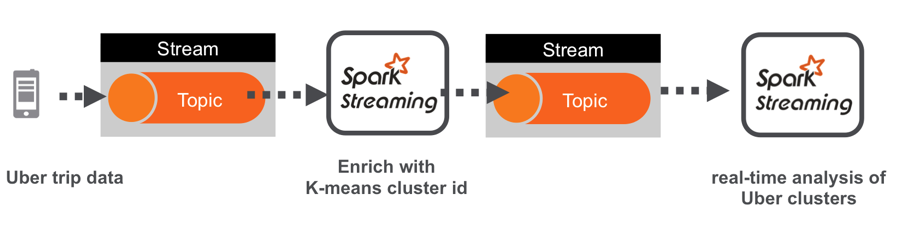
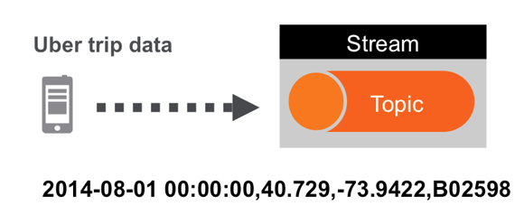
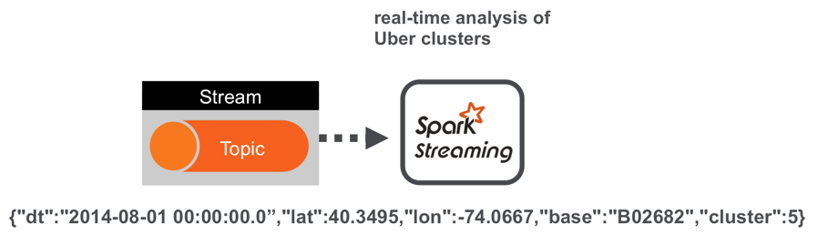
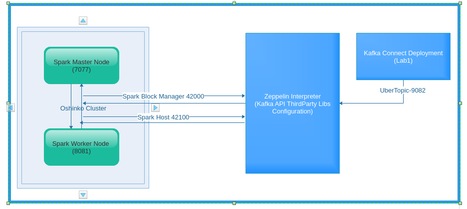

:noaudio:
:scrollbar:
:data-uri:
:toc2:
:linkattrs:

= Spark Analysis of Realtime Data

.Goals
* Apache Spark Deployment and Kafka Streaming.
* Uber Realtime Data Analysis using Advanced Concept of Spark (SparkSQL)
* Usage of Interactive NoteBooks like Apache Zeppelin

.Prerequisite
* Skills
** Don't clean up the Lab1 Environment, As we are going to use the Kafka Cluster to do the Realtime data streaming
** Programming Knowledge of Python, Scala and Java Languages
** Knowledge of GIT Commands
** Knowledge on OpenShift Deployments
** Knowledge of Messaging system and Messaging Architecture
** Basic Knowledge of Cluster Computing and Distributed Architetcures
** GIT Clone of the Source code into Student's Desktop

* Tools
** `curl` utility
** `sed` utility
** `oc` version 3.9 utility
** `Interactive Notebooks - Zeppelin`
** `git` command basics

:numbered:

== Overview

We will build a real-time example for analysis and monitoring of Uber car GPS trip data.

The first project discussed creating a machine learning model using Apache Spark’s K-means algorithm to cluster Uber data based on location. This complex project will discuss using the saved K-means model with streaming data to do real-time analysis of where and when Uber cars are clustered

image::images/picture1.png[uberstream10]

=== Technical Background
==== Apache Spark
. *Apache Spark*
+
Apache Spark is a fast, easy-to-use and general engine for big data processing that has built-in modules for streaming, SQL, Machine Learning (ML) and graph processing. Spark is a cluster-computing framework, which means that it competes more with MapReduce than with the entire Hadoop ecosystem. For example, Spark doesn't have its own distributed filesystem, but can use HDFS. Spark uses memory and can use disk for processing, whereas MapReduce is strictly disk-based.

. *Apache Kafka*
+
Kafka is used for building real-time data pipelines and streaming apps. It is horizontally scalable, fault-tolerant, wicked fast, and runs in production in thousands of companies.

. *Spark MLlib*
+
MLib is Spark's scalable machine learning library consisting of common learning algorithms and utilities, including classification, regression, clustering, collaborative filtering, dimensionality reduction, as well as underlying optimization primitives.

. *Apache Zeppelin*
+
Apache Zeppelin is a multi-purpose web-based notebook which brings data ingestion, data exploration, visualization, sharing and collaboration features to Hadoop and Spark.
Based on the concept of an interpreter that can be bound to any language or data processing backend, Zeppelin is a web based notebook server.
As one of its backends, Zeppelin implements Spark, and other implementations, such as Hive, Markdown, D3 etc., are also available.
Zeppelin has support for multiple interpreters like Scala, Python, Kotlin, HBase.
Zeppelin has a built in Scala and Python Intepretors.
These interpreters can be utilized to visualize raw historical data.

. *Spark Notebook*
+
The Spark Notebook is the open source notebook aimed at enterprise environments, providing Data Scientists and Data Engineers with an interactive web-based editor that can combine Scala code, SQL queries, Markup and JavaScript in a collaborative manner to explore, analyse and learn from massive data sets.

. *Spark SQL*
+
Spark SQL is a Spark module for structured data processing. It enables unmodified Hadoop Hive queries to run up to 100x faster on existing deployments and data. It also provides powerful integration with the rest of the Spark ecosystem (e.g., integrating SQL query processing with machine learning).

. *Resilient Distributed Datasets*
+
Resilient Distributed Datasets (RDD) is a fundamental data structure of Spark. It is an immutable distributed collection of objects. Each dataset in RDD is divided into logical partitions, which may be computed on different nodes of the cluster. Spark Actions are RDD operations that produce non-RDD values. They materialize a value in a Spark program. In other words, a RDD operation returns a value of any type.

. *SparkContext*
+
SparkContext is the heart of a Spark application. Once a SparkContext is created you can use it to create RDDs, accumulators and broadcast variables, access Spark services and run jobs (until SparkContext is stopped).

==== Oshinko

The _Oshinko_ project covers several individual applications which all focus on the goal of deploying and managing Apache Spark clusters on Red Hat OpenShift Container Platform.

This Lab demonstrates the usage of an Oshinko cluster running in your OpenShift Container Platform environment.

=== Reference

.  http://spark.apache.org/
.  http://spark.apache.org/examples.html
.  http://spark.apache.org/mllib/
.  https://jaceklaskowski.gitbooks.io/mastering-apache-spark/
.  https://www.amazon.in/Learning-Spark-Holden-Karau/dp/1449358624
.  https://spark.apache.org/sql/
.  https://www.youtube.com/watch?v=zHbxbb2ye3E
.  https://kafka.apache.org/
.  https://spark.apache.org/streaming/

=== Validate Environment Variables
In a previous lab, you should have already set various environment variables in the shell of your lab environment.

At this time, ensure that the following environment variables remain set:

-----
echo "export OCP_PROJECT=\$OCP_USERNAME-uber-realtime-data" >> ~/.bashrc

source ~/.bashrc

$ echo $OCP_USERNAME
developer

$ echo $OCP_PASSWD
xxxxxxxx
-----

== Lab Asset Overview

This lab provides a set of assets to assist with the provisioning of Oshinko and Zeppelin.
You will want to clone these lab assets to your lab environment so that you can review them.

. Make a new directory where all lab assets will reside.
  Already the lab assets are cloned in Lab1. Please refer instructions of Lab1.
. Change directory to the newly cloned project.

=== Code Analysis of Lab 3

https://github.com/gpe-mw-training/operational_intelligence/tree/master/uber-realtime-spark-stream-analysis

There are 6 main programs in the GitHub, We can individually deploy as a Spark Job or Can execute in the Zeppelin Notebook.
Entire Flow is with KafkaProducerConsumer.scala. Hence we analyse with this code and apply in the zeppelin notebook.

==== Data Pipeline

A Spark streaming application subscribed to the topic UberInput ingests a stream of uber trip events. It identifies the location cluster corresponding to the latitude and longitude of the uber trip. It adds the cluster location to the data tuple and publishes the results in JSON format to the UberRealTime topic. A Spark streaming application subscribed to the UberRealTime topic analyzes the uber trip location clusters that are popular by date and time.

==== Data Flow in Detail
The Uber trip data is in the following format

date/time, latitude,longitude,base
2014-08-01 00:00:00,40.729,-73.9422,B02598

Data will be enriched are in JSON Format which is given below

Spark Kafka Producer Consumer Code with Enriched Data

image::images/picture5.png[berstream14]

==== Code flow

Parse the DataSet Records (Uber case class)
Load the KMeans model

===== Spark Streaming Code

These are the basic steps for the Spark Streaming Consumer Producer code:
. Configure Kafka Consumer Producer properties.
. Initialize a Spark StreamingContext object. Using this context, create a DStream which reads message from a Topic.
. Apply transformations (which create new DStreams).
. Write messages from the transformed DStream to a Topic.
. Start receiving data and processing. Wait for the processing to be stopped.

We will go through each of these steps with the example application code.

=== Configure Spark Kafka Consumer Producer Properties

The first step is to set the KafkaConsumer and KafkaProducer configuration properties, which will be used later to create a DStream for receiving/sending messages to topics. You need to set the following paramters:

Key and value deserializers: for deserializing the message.

Auto offset reset: to start reading from the earliest or latest message.

Bootstrap servers: this can be set to a dummy host:port since the broker address is Strimzi Kafka POD

----
...

[root@localhost ~]# oc login -u user5 -p r3dh4t1! https://master.6d13.openshift.opentlc.com/
Login successful.

You have one project on this server: "uber-realtimedata-analysis-user5"

Using project "uber-data-user5".
[root@localhost ~]# oc get routes
NAME              HOST/PORT                                                         PATH      SERVICES          PORT       TERMINATION   WILDCARD
apache-zeppelin   apache-zeppelin-uber-realtimedata-analysis-user5.apps.6d13.openshift.opentlc.com             apache-zeppelin   8080-tcp                 None
...
----

== Zeppelin Configuration Changes to run the code

This is one of the most critical steps, Please follow the screen shot's carefully. Missing a single step will lead to unexpected results and exceptions.

----
...
$ oc get pods

$ oc rsh apache-zeppelin-2-dr8s6

sh-4.2$ cd /opt/zeppelin/conf/

sh-4.2$ ls
configuration.xsl  log4j_yarn_cluster.properties  zeppelin-site.xml
interpreter-list   shiro.ini.template		  zeppelin-site.xml.template
interpreter.json   zeppelin-env.cmd.template
log4j.properties   zeppelin-env.sh.template

sh-4.2$ mv zeppelin-env.sh template zeppelin-env.sh

sh-4.2$ vi zeppelin-env.sh

export SPARK_SUBMIT_OPTIONS="--packages org.apache.spark:spark-sql-kafka-0-10_2.11:2.3.0"

sh-4.2$ esc+wq!

...
----
== Zeppelin UI Changes to Run the Code

Make Changes in Spark.Memory Parameters to 5G

zeppelin Dependency Local Repo as shown in the Figure

image::images/ZeppelinUIChangesLab3.png[zepp5ui]

== Deployment Topology

== Conclusions

Finally you have learned the concepts of Spark Cluster, Actions, Transformations, Spark SQL and NoteBook Deployment.

== Questions

TO-DO :  questions to test student knowledge of the concepts / learning objectives of this lab

== Appendix

===  Overview

So far we learned about Spark uses Zeppelin Notebook and Performs the Data Analysis based on the Uber RealTime Data.

ifdef::showscript[]

endif::showscript[]
