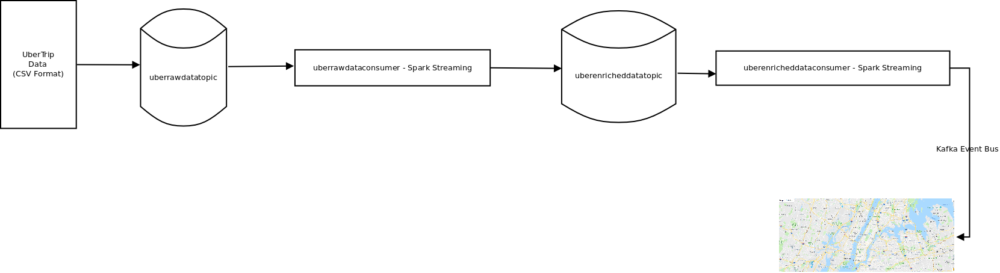
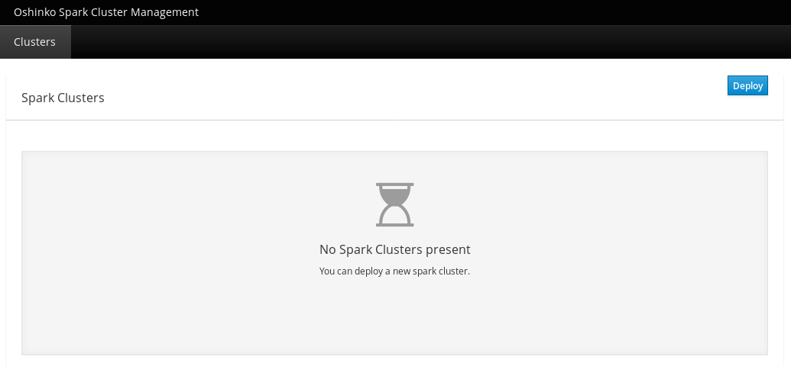
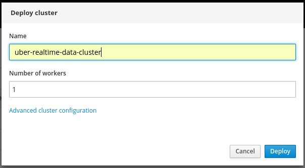
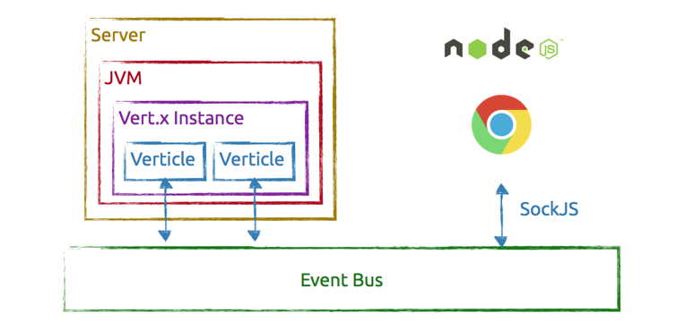
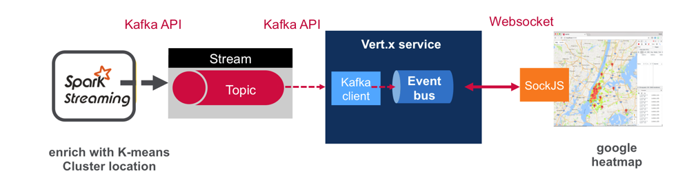

:noaudio:
:scrollbar:
:data-uri:
:toc2:
:linkattrs:

= Automated Analysis of Uber traffic using AMQ Streams

.Goals
. Importing of a json file of traffic cluster centers
. Consumption of raw Uber data record stream via a Kafka Topic
. Enrichment of streamed Uber data with assignment of specific traffic cluster center Id to each record
. Additional enrichment of streamed Uber data with assignment of a key performance indicator to each record
. Publishing of Enriched Data records to a different Kafka Topic for additional downstream rule processing
. Visualization of heat-map of simulated traffic in cluster centers

.Prerequisite
* Skills
** Programming knowledge using link:https://vertx.io/[vert.x]

:numbered:

== Overview

=== Key Performance Indicators

[red]#TO-DO#

=== Technical Background

. *link:https://spark.apache.org/docs/2.2.0/streaming-kafka-0-8-integration.html[Spark / Kafka Integration]*

. *link:https://kafka.apache.org/documentation/#api[Kafka Streaming API]*

.. The *Producer API* allows applications to send streams of data to topics in the Kafka cluster.
.. The *Consumer API* allows applications to read streams of data from topics in the Kafka cluster.
.. The *Streams API* allows transforming streams of data from input topics to output topics.
.. The *Connect API* allows implementing connectors that continually pull from some source system or application into Kafka or push from Kafka into some sink system or application.
.. The *AdminClient* API allows managing and inspecting topics, brokers, and other Kafka objects.

. *link:https://vertx.io/[vert.x]*

=== Architecture
. Data flow:
+
Uber trip data is published to a Kafka Streams topic using the Kafka API. A Spark streaming application subscribed to the first topic: Ingests a stream of uber trip events Identifies the location cluster corresponding to the latitude and longitude of the uber trip Adds the cluster location to the event and publishes the results in JSON format to another topic A Spark streaming application subscribed to the second topic: Analyzes the uber trip location clusters that are popular by date and time.
+
[red]#TO-DO#

=== Modify the Environment Variables
In a previous lab, you should have already set various environment variables in the shell of your lab environment.

At this time, ensure that the following environment variables remain reset:

-----
echo "export OCP_PROJECT=\$OCP_USERNAME-uber-realtime-data" >> ~/.bashrc

echo "export OCP_REGION=`echo $HOSTNAME | cut -d'.' -f2`" >> ~/.bashrc

echo "export OCP_DOMAIN=clientvm.\$OCP_REGION.rhte.opentlc.com" >> ~/.bashrc

echo "export OCP_WILDCARD_DOMAIN=apps.\$OCP_DOMAIN" >> ~/.bashrc

source ~/.bashrc

$ echo $OCP_USERNAME
developer

$ echo $OCP_PASSWD
xxxxxxxx
-----

== Lab Asset Overview

This lab provides a set of assets to assist with the provisioning of Oshinko and Zeppelin.
You will want to clone these lab assets to your lab environment so that you can review them.

. Make a new directory where all lab assets will reside.
  Already the lab assets are cloned in Lab1. Please refer instructions of Lab1.
. Change directory to the previously cloned lab asset.
+
-----
$ cd $HOME/lab/operational_intelligence/uber-realtime-spark-stream-analysis

-----

. Review the various files specific to this lab :
+
-----
uber-realtime-spark-stream-analysis/
├── data
│   ├── cluster.txt
│   └── uber.csv
├── notebooks
│   ├── ubernearrealtime.json
│  
├── pom.xml
├── ReadMe.adoc
└── src
    └── main
        ├── java
        │   └── com
        │       └── streamskafka
        │           └── uber
        │               ├── MsgConsumer.java
        │               └── MsgProducer.java
        └── scala
            └── com
                ├── sparkkafka
                   └── uber
                       ├── UberEnrinchmentDataConsumer.Scala
                       |-- UberRawDataConsumer.Scala
                       |-- UberRawDataProducer.Scala

-----

. Several key assets to review are as follows:

.. *pom.xml*
+
Notice that community Apache Spark and community Scala packages are being utilized.
At this time, Red Hat does not intend to provide supported versions of these packages.

.. *Large Datasets of Uber Data*

... Available in the lab assets at:  `uber-data-analysis/src/main/resources/data/uber.csv`
... It is the raw data from the UberData for NLC which describes the Latitude, Longitude, timestamp and BaseId

.. *UberEnrinchmentDataConsumer.scala*

  ... Consumes the Uber.csv file which is a near-real-time-uber-data and send its to the UberTopic which has already been created in Lab1.
  ... Produces the Enriched UberData with KMeans clusterId which is send to the spark streaming which helps for accurate predictions.
 .. How Integration happening with Spark ?
 ... In Lab1 we create a topic called UberTopic which consumes the Uber.csv file and pushed into the spark-streaming. Please refer the deployment Topology diagram with Uber.csv file.

== Kafka Strimzi Assets
Recall the OC commands created in Lab1.

== Oshinko

=== Oshinko Web UI

. Log into OpenShift Environment using OC Client Tool to your Lab Region
+
-----
$ oc login https://$HOSTNAME:8443 -u $OCP_USERNAME -p $OCP_PASSWD
-----

. Create and switch to the OCP project specific to this lab:
+
-----
$ oc new-project $OCP_USERNAME-uber-realtime-data --description=$OCP_USERNAME-uber-realtime-data

$ oc project $OCP_USERNAME-uber-realtime-data
-----

. In your OpenShift namespace, create needed Oshinko templates:
+
-----
$ oc create \
     -f https://raw.githubusercontent.com/gpe-mw-training/operational_intelligence/1.0.3/templates/oshinko-cluster.yaml \
     -n $OCP_USERNAME-uber-realtime-data
-----

. Provision the Oshinko-WebUI
+
-----

$ oc new-app oshinko-webui -n $OCP_USERNAME-uber-realtime-data > /tmp/oshinko-web.txt

-----
+
.. Review the output found in /tmp/oshinko-web.txt
+
----
--> Deploying template "developer-uber-realtime-data/oshinko-webui" to project developer-uber-realtime-data

     * With parameters:
        * SPARK_DEFAULT=
        * OSHINKO_WEB_NAME=oshinko-web
        * OSHINKO_WEB_IMAGE=radanalyticsio/oshinko-webui:stable
        * OSHINKO_WEB_ROUTE_HOSTNAME=
        * OSHINKO_REFRESH_INTERVAL=5

--> Creating resources ...
    service "oshinko-web-proxy" created
    service "oshinko-web" created
    route "oshinko-web" created
    deploymentconfig "oshinko-web" created
--> Success
    Access your application via route 'oshinko-web-user3-uber-data.apps.6d13.openshift.opentlc.com'
    Run 'oc status' to view your app.

----
. Review the template that has been created
+
-----
$ oc get template oshinko-webui -n $OCP_USERNAME-uber-realtime-data -o yaml | more
-----

. Wait until both containers of the oshinko-web pod have started:
+
-----
$ oc get pods -w
NAME                  READY     STATUS    RESTARTS   AGE

oshinko-web-1-86blg   2/2       Running   0
-----

. Log into the Oshinko web UI
.. Point your browser to the output of the following command:
+
-----
$ echo -en "\n\nhttp://"$(oc get route/oshinko-web -o template --template {{.spec.host}} -n $OCP_USERNAME-uber-realtime-data)/webui"\n\n"
-----
+

.. At this time, the Oshinko web UI is not secured. It is recommended to use Oshinko webui non-secured port.
+
Subsequently, you should be able to access the UI without authenticating.

=== Oshinko Cluster
In a real-time scenario, we would have different clusters for each services and use cases. Hence, we are not going to use the same cluster which was used in Lab2. We are going to create a new cluster for Lab3.
Because of this cluster can act as an Independent services. Hence we are doing this.

Via the Oshinko Web UI, you can now create an Oshinko cluster which will consist of both a master and worker pods.

. In the homepage of the Oshinko Web UI, click: `Deploy`
. Populate the pop-up with the following:
.. *Name*: uber-realtime-data-cluster
.. *Number of workers*: 1
. Click the `Deploy` button
+

. Two `Deployment Config` resources will have been created.
These two DCs are responsible for the provisioning of the Oshinko Master and Worker.
These DCs are not configured with limits and requests as required by your lab environment.
Execute the following series of steps to add limits and requests to your DCs so that the underlying pods will start:

.. Add limits and requests to the master pod:
+
-----
$ oc patch dc/uber-realtime-data-cluster-m -n $OCP_USERNAME-uber-realtime-data \
    --patch '{"spec":{"strategy":{"resources": { "limits":{"cpu": "2","memory": "4Gi"},"requests":{"cpu":"1","memory":"512Mi"}   } }}}'

$ oc patch dc/uber-realtime-data-cluster-m -n $OCP_USERNAME-uber-realtime-data \
    --patch '{"spec":{"template":{"spec":{"containers":[{"name":"uber-realtime-data-cluster-m", "resources": {   "limits":{"cpu": "1","memory": "2Gi"},"requests":{"cpu":"500m","memory":"256Mi"}   }}]}}}}'
-----

.. Add limits and requests to the worker pod:
+
-----
$ oc patch dc/uber-realtime-data-cluster-w -n $OCP_USERNAME-uber-realtime-data \
   --patch '{"spec":{"strategy":{"resources": { "limits":{"cpu": "2","memory": "4Gi"},"requests":{"cpu":"1","memory":"512Mi"}   } }}}'

$ oc patch dc/uber-realtime-data-cluster-w -n $OCP_USERNAME-uber-realtime-data \
       --patch '{"spec":{"template":{"spec":{"containers":[{"name":"uber-realtime-data-cluster-w", "resources": {   "limits":{"cpu": "1","memory": "2Gi"},"requests":{"cpu":"500m","memory":"256Mi"}   }}]}}}}'
-----

.. The end result are the new Oshinko master and worker pods having started:
+
-----
$ oc get pods
NAME                          READY     STATUS      RESTARTS   AGE
...

uber-realtime-data-cluster-m-2-b4cl4   1/1       Running     0          1m
uber-realtime-data-cluster-w-2-678fp   1/1       Running     0          10s
-----

=== What we did in the Lab2?
In Lab2 we just created a model with the Historical data (Uber.csv), build a training set, Identified the patterns and did a Test Predictions.

In Lab3 we are going to use the Deployed Model and to give accurate predictions.

image::images/picture1.png[recall]

=== Importing of JSON File of different traffic cluster centers
[red]#TO-DO#

==== Deployment diagram
[red]#TO-DO#

==== OC commands
[red]#TO-DO#

=== Consumption of Raw Uber Data Record Stream Via a Kafka topic
[red]#TO-DO#

===== Ranking - Why it is important?
In lab2, we could display the cluster centers in Zeppelin notebooks which shows the ranking. Here the ranking is static, which helps us to learn about the pattern recognition and historical analysis of data.
In lab3, we use the ranking which is dynamic helps in calculating the raise in price which is used by the Red Hat Decision Manager.

==== Deployment diagram
[red]#TO-DO#

==== OC commands
[red]#TO-DO#

=== Enrichment of UberRawData
[red]#TO-DO#

==== Deployment diagram
[red]#TO-DO#

==== OC commands
[red]#TO-DO#

=== Visualization of Heat-Map of simulated Traffic in Cluster centers
== The vert.x toolkit and Web Application Architecture

The Vert.x toolkit is event-driven, using an event bus to distribute events to work handler services, called verticles. Vert.x, similar to Node.js, employs a non-blocking model with a single threaded event-loop to handle work. The Vert.x SockJS event bus bridge allows web applications to communicate bi-directionally with the Vert.x event bus using Websockets, which allows you to build real-time web applications with server push functionality.
+

==== Deployment diagram
+

A Vert.x Kafka client verticle consumes messages from the Kafka Streams topic and publishes the messages on a Vert.x event bus.
A Javascript browser client subscribes to the Vert.x event bus using SockJS and displays the Uber trip locations on a Google Heatmap.

==== OC commands
[red]#TO-DO#

=== Overall Integration
[red]#TO-DO#

==== Architecture and Deployment diagram
[red]#TO-DO#

== Conclusions

====  What did we learn?

Apache Strimzi - Basics of Apache Strimzi and it's deployment on OpenShift.

Spark Streaming - Excellent API for structured streaming and it is an advanced concept in Apache Spark. Since, it uses catalyst optimizer, it provides an excellent performance benefits and it is the most prefered query language for the datascientists all over the world.

Kafka with Apache Spark Integration - We learned Apache Kafka integration with Spark on Strimzi Cluster.

== Questions

TO-DO :  questions to test student knowledge of the concepts / learning objectives of this lab

== Appendix

=== Where do we get these DataSets?

http://data.beta.nyc/dataset/uber-trip-data-foiled-apr-sep-2014

ifdef::showscript[]

=== ClusterQuota and Limit Range for Zeppelin Interpreter

==== Cluster Quota
A resource quota, defined by a ResourceQuota object, provides constraints that limit aggregate resource consumption per project. It can limit the quantity of objects that can be created in a project by type, as well as the total amount of compute resources and storage that may be consumed by resources in that project.

==== Limit Range
A limit range, defined by a LimitRange object, enumerates compute resource constraints in a project at the pod, container, image, image stream, and persistent volume claim level, and specifies the amount of resources that a pod, container, image, image stream, or persistent volume claim can consume.

All resource create and modification requests are evaluated against each LimitRange object in the project. If the resource violates any of the enumerated constraints, then the resource is rejected. If the resource does not set an explicit value, and if the constraint supports a default value, then the default value is applied to the resource.

By default, all OCP projects are assigned a limit range.  the limit range assigns default limits and requests for both CPU and RAM if the DCs themselves don't specify limits and requests.
The default CPU limit is set to 1/20th of a CPU.  So Spark was running on 1/20th of a CPU.

In general, all of us should always understand the details of LimitRanges assigned to our projects.
And its very likely that we should be adding/tweaking the limits and requests in our DC's.

==== CPU Limits

Each container in a pod can specify the amount of CPU it is limited to use on a node. CPU limits control the maximum amount of CPU that your container may use independent of contention on the node. If a container attempts to exceed the specified limit, the system will throttle the container. This allows the container to have a consistent level of service independent of the number of pods scheduled to the node.

==== Memory Requests
By default, a container is able to consume as much memory on the node as possible. In order to improve placement of pods in the cluster, specify the amount of memory required for a container to run. The scheduler will then take available node memory capacity into account prior to binding your pod to a node. A container is still able to consume as much memory on the node as possible even when specifying a request.

==== Memory Limits
If you specify a memory limit, you can constrain the amount of memory the container can use. For example, if you specify a limit of 200Mi, a container will be limited to using that amount of memory on the node. If the container exceeds the specified memory limit, it will be terminated and potentially restarted dependent upon the container restart policy.

=== Do we need to Know them
The above parameters are managed by the cluster Administrator and Infrastructure team, Hence it is not needed for the students to learn. But a basic concept of Knowing this will help.

*Students are expected to learn this much alone.*
----
For Viewing Quotas

$ oc get quota -n user3-uber-data
NAME                AGE
besteffort          11m
compute-resources   2m
object-counts       29m
...
...
$ oc describe quota object-counts -n user3-uber-data
Name:			object-counts
Namespace:		user3-uber-data
Resource		Used	Hard
--------		----	----
configmaps		3	10
persistentvolumeclaims	0	4
replicationcontrollers	3	20
secrets			9	10
services		2	10

For Viewing Limit Ranges

$ oc get limits -n user3-uber-data
NAME              AGE
resource-limits   6d

$ oc describe limits resource-limits
Name:		resource-limits
Namespace:	use3-uber-data
Type		Resource	Min	Max	Default Request	Default Limit	Max Limit/Request Ratio
----		--------	---	---	---------------	-------------	-----------------------
Pod		cpu		30m	2	-		-		-
Pod		memory		150Mi	1Gi	-		-		-
Container	memory		150Mi	1Gi	307Mi		512Mi		-
Container	cpu		30m	2	60m		1		-

$ oc describe limits resource-limits -n user3-uber-data
Name:                           resource-limits
Namespace:                      demoproject
Type                            Resource                Min     Max     Default Request Default Limit   Max Limit/Request Ratio
----                            --------                ---     ---     --------------- -------------   -----------------------
Pod                             cpu                     200m    2       -               -               -
Pod                             memory                  6Mi     1Gi     -               -               -
Container                       cpu                     100m    2       200m            300m            10
Container                       memory                  4Mi     1Gi     100Mi           200Mi           -
openshift.io/Image              storage                 -       1Gi     -               -               -
openshift.io/ImageStream        openshift.io/image      -       12      -               -               -
openshift.io/ImageStream        openshift.io/image-tags -       10      -               -               -

endif::showscript[]
